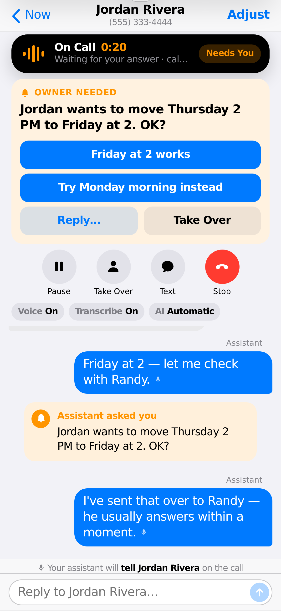
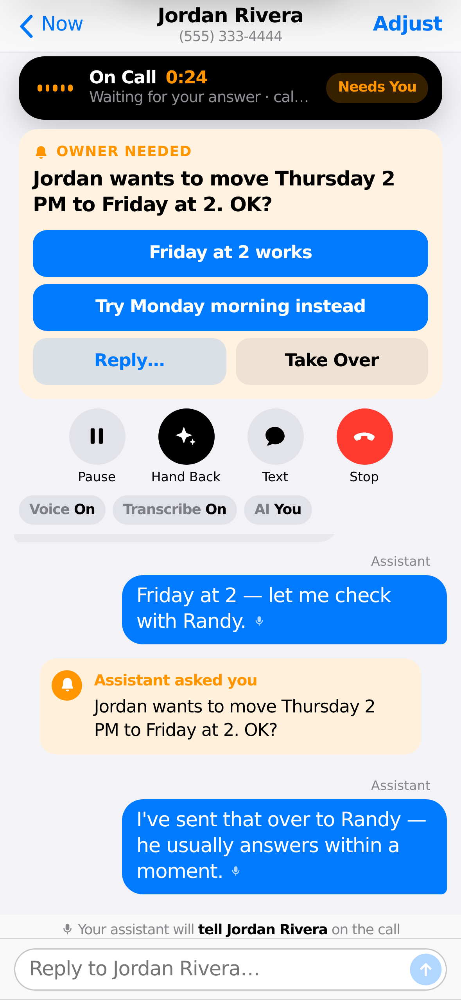
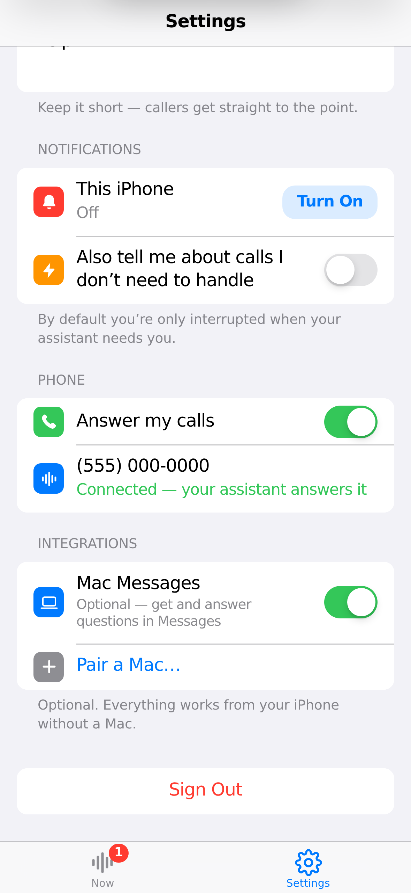

# text-me

A conversational inbox for your phone, as a multi-tenant service. Anyone can
sign up: each account gets its own assistant line, its own devices and its own
control plane. The assistant answers calls, handles what it can, asks the
owner when it must, and moves conversations to text when that fits. Owners
watch it live and step in from their phone in one tap.

- **Callers** just call. They hear a short greeting, explain what they need,
  and get help, with no menus, disclaimers or AI talk.
- **The owner** uses an **iPhone** (a Home Screen web app, no Mac needed).
  They get a notification only when the assistant needs them. Tapping it
  opens that live conversation, where they can answer in one tap, take over,
  adjust the assistant for this one conversation, or move it to text.

| Notification opens the live call | Take Over from the notification | Settings |
|---|---|---|
|  |  |  |

## Architecture

```
                         VERCEL (Fluid compute)
┌──────────────────────────────────────────────────────────────┐
│  Control plane (public/index.html)  ──  REST + SSE           │
│  Express app (src/http-app.ts)                                │
│   ├─ Conversation service / owner replies (one mediated path) │
│   ├─ Runtime control: commands, overrides, revisions          │
│   └─ Realtime voice: Twilio media stream ↔ AI Gateway         │
│        AI SDK 7: gateway.experimental_realtime (voice)        │
│                  generateText + tools (SMS)                   │
└───────────────┬───────────────────────────────┬──────────────┘
                │ LISTEN/NOTIFY + all state      │
              NEON                           TWILIO  (voice + SMS)
                                             OWNER   (web, Messages, SMS)
```

- **Voice is a transport.** A call answers with `<Connect><Stream>`; the
  server bridges Twilio's 8 kHz μ-law audio straight to an AI Gateway realtime
  model (default `openai/gpt-realtime-2`, no resampling). Moving to text is a
  channel change on the same conversation.
- **Neon is the source of truth**: conversations and events, runtime state,
  per-conversation overrides, runtime commands, owner settings, devices and
  deliveries. The browser holds presentation state only.
- **Owner controls reach the live call from any instance.** Every command is
  recorded in `runtime_commands`, published over Postgres `LISTEN/NOTIFY`, and
  marked `applied_live` by the instance holding the call.
- **The account is the unit of ownership.** Accounts, users, memberships,
  phone numbers, planes, devices, conversations, attention and commands are
  account-scoped records; every request is authorized as
  principal → membership → account → resource. Environment variables hold
  platform configuration and secrets only. See
  [`docs/saas-readiness.md`](docs/saas-readiness.md) and
  [`docs/saas-audit.md`](docs/saas-audit.md).
- **Conversation is the product; devices are surfaces.** The assistant raises
  durable **owner attention**; one router delivers it to the owner's surfaces:
  iPhone push (default), Mac Messages (optional integration), or SMS to the
  owner's phone (fallback). No surface is required for a call to work.
- **Defaults → conversation override → live runtime.** Settings are defaults;
  Adjust changes only the conversation you're looking at.

See [`docs/cx-journey.md`](docs/cx-journey.md) for the end-to-end journeys
and the audit checklist.

## Deploy (Vercel + Neon + Twilio)

1. **Import the repo in Vercel.** It deploys as a Node server
   (`src/server.ts`) with `public/` served from the CDN. `vercel.json` enables
   Fluid compute and a longer `maxDuration` for live calls.
2. **Add Neon** from the Vercel Marketplace (Storage → Neon). It sets
   `DATABASE_URL` (pooled) and `DATABASE_URL_UNPOOLED` (used for
   `LISTEN/NOTIFY`). Tables are created automatically on first request.
3. **AI Gateway** authenticates with Vercel OIDC automatically on Vercel. No
   key is needed. Elsewhere, set `AI_GATEWAY_API_KEY`.
4. **Set environment variables** (Project → Settings → Environment Variables).
   Every variable, and exactly where to get it, is in
   [`docs/release-audit.md` §6](docs/release-audit.md#6-environment-variables-where-to-get-each-one).
   The required ones are platform credentials only: `TWILIO_ACCOUNT_SID` and
   `TWILIO_AUTH_TOKEN` (the platform's Twilio account; its numbers are the
   pool of assistant lines accounts claim). No variable names a customer.
5. **Check it:** `https://<project>.vercel.app/health/ready` must return 200.
   Production refuses to start with fakes or in-memory state and says what's
   missing.
6. **Open `https://<project>.vercel.app` and create an account** (any number
   of people can, on the same deployment). Setup walks through your name,
   **your number** (claim an assistant line, verify your mobile, turn on
   carrier forwarding so callers keep dialing your real number), your
   assistant, and notifications. Upgrading a single-owner deployment? Run
   `npm run migrate:legacy` once first ([`docs/saas-migration.md`](docs/saas-migration.md)).
7. **Run the acceptance journey** against the deployment:
   `ACCEPTANCE_PASSWORD=… npm run acceptance -- --url https://<project>.vercel.app --email <account email>`.
8. *Optional:* the native iOS app is in [`ios/`](ios/README.md).

## Run locally

```bash
npm install
cp .env.example .env   # set DATABASE_URL and the platform's Twilio values
npm run dev
```

Without an AI Gateway key, calls use the local fake voice pipeline and fake
providers; `POST /webhooks/fake/voice` and `/webhooks/fake/status` simulate
calls outside production.

## Test

```bash
npm test                                       # all tests; the Postgres ones skip without TEST_DATABASE_URL
TEST_DATABASE_URL=postgres://… npm test        # + Postgres: multi-instance scaling, legacy migration, LISTEN/NOTIFY
npm run journey:saas                           # two customers, two browsers, one deployment (Chromium)
```

The realtime tests run a real HTTP/WebSocket server with a Twilio-side client
and a scripted realtime model; one test drives the real AI SDK Gateway
connector against a local stand-in for the Gateway wire protocol.

## API (owner)

| Route | Purpose |
|---|---|
| `GET /conversations`, `GET /conversations/:id` | Inbox and conversation, including `runtime.status`, `ownerRequest`, `voice.live` |
| `GET /conversations/:id/runtime/events` | SSE stream of runtime events |
| `POST /conversations/:id/runtime/{pause,resume,stop,start,takeover,return-to-assistant,interrupt,transition-to-sms}` | Live controls (optional `expectedRevision`, `commandId`) |
| `PATCH /conversations/:id/runtime` | Adjust this conversation (per-conversation overrides) |
| `POST /conversations/:id/messages` | Owner reply, relayed by the assistant on the call or by text |
| `GET /conversations/:id/runtime/commands`, `GET /conversations/:id/audit` | Command history and full id-linked timeline |
| `GET/PATCH /owner/configuration` | Defaults for new calls |
| `GET /owner/attention`, `POST /owner/attention/:id/{opened,dismiss,actions}` | What needs the owner; one-tap Reply / Take Over from a notification |
| `GET /owner/push/config`, `GET/POST /owner/push/devices`, `DELETE /owner/push/devices/:id`, `POST /owner/push/test` | Notification devices (web today; iOS/macOS-ready schema) |
| `GET /owner/phone`, `POST /owner/phone/connect` | The owner's number, connected without a provider console |
| `GET /owner/events` | Owner-wide live stream |
| `/conversations/:id/live` | Deep link straight into one live conversation |

Accounts: `POST /auth/signup`, `POST /auth/sessions`, `GET /me`,
`POST /auth/session/account`, `POST /accounts`, and the setup routes under
`/account/*` (onboarding, phone line and number verification, plane,
notification channels, members). The full client contract, which the iOS app
also uses, is in [`docs/owner-api.md`](docs/owner-api.md).

Twilio webhooks: `POST /webhooks/twilio/voice`, `/webhooks/twilio/status`,
`/webhooks/twilio/sms`, `/webhooks/twilio/voice/continue`, and the media
stream WebSocket at `/media-stream`.

## Mac Messages bridge (optional)

An optional integration; nothing in the product depends on it. With it, the
assistant's questions arrive in Apple Messages and your replies go straight back
into the conversation. There is nothing to configure on the Mac:

1. On the Mac: `npm install && npm run build && npm run bridge:macos`.
   A **Connect this Mac** window opens with a camera viewfinder.
2. On your iPhone: **Settings → Connected Devices → Connect a Mac** shows a QR code.
   Hold it up to the Mac's camera. The iPhone goes from *Waiting for Mac…* to
   *Mac connected ✓* and continues to Messages setup.
3. Pick the assistant chat (your own thread) on the iPhone, and use
   **Test connection** to check it end to end without sending anything.

The QR carries only a single-use code that expires in five minutes and the
address of your deployment. The Mac stores only its own device credential and
that address (`~/Library/Application Support/Attn Bridge`). Everything else is
your configuration on the server, which the Mac follows by revision: turning
**Apple Messages** off on the iPhone stops the Messages watcher without
restarting anything. Revoking the Mac on the iPhone disconnects it immediately,
and the bridge reopens the scanner so it can be reconnected with a new code.

The bridge reads Messages through [Photon iMessage Kit](https://www.npmjs.com/package/@photon-ai/imessage-kit)
(an optional dependency, never loaded by the server). macOS asks for **Full
Disk Access** (to read Messages) and **Automation → Messages** (to send) the
first time. Only your own thread is ever offered to the server as the assistant
chat; other chats, contacts and message history stay on the Mac.
