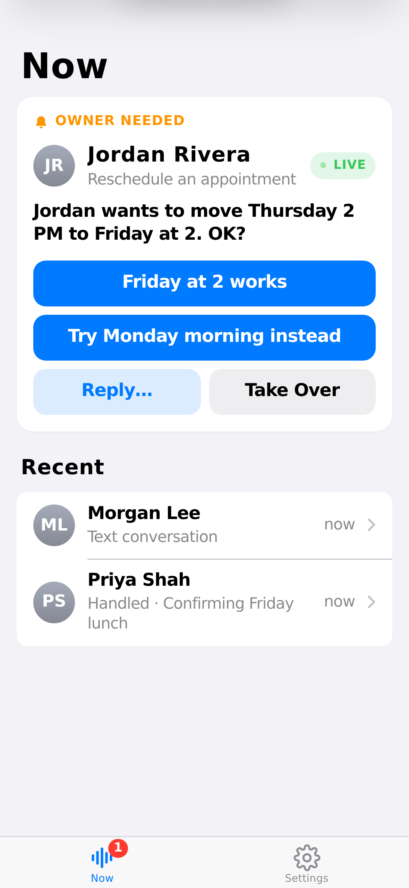

# text-me

A conversational inbox for your phone. Your assistant answers calls, handles
what it can, asks you when it must, and moves conversations to text when that
fits. You watch it live and step in from your phone in one tap.

- **Callers** just call. They hear a short greeting, explain what they need,
  and get help, with no menus, disclaimers or AI talk.
- **The owner** opens **Now**. It shows what needs them, what's live, and
  lets them take over, answer a question, adjust the assistant for this one
  conversation, or move it to text.



## Architecture

```
                         VERCEL (Fluid compute)
┌──────────────────────────────────────────────────────────────┐
│  Control plane (public/index.html)  ──  REST + SSE           │
│  Express app (src/app.ts)                                     │
│   ├─ Conversation service / owner replies (one mediated path) │
│   ├─ Runtime control: commands, overrides, revisions          │
│   └─ Realtime voice: Twilio media stream ↔ AI Gateway         │
│        AI SDK 7: gateway.experimental_realtime (voice)        │
│                  generateText + tools (SMS)                   │
└───────────────┬───────────────────────────────┬──────────────┘
                │ LISTEN/NOTIFY + all state      │
              NEON                           TWILIO  (voice + SMS)
                                             OWNER   (web, Messages, SMS)
```

- **Voice is a transport.** A call answers with `<Connect><Stream>`; the
  server bridges Twilio's 8 kHz μ-law audio straight to an AI Gateway realtime
  model (default `openai/gpt-realtime-2`, no resampling). Moving to text is a
  channel change on the same conversation.
- **Neon is the source of truth**: conversations and events, runtime state,
  per-conversation overrides, runtime commands, owner settings, devices and
  deliveries. The browser holds presentation state only.
- **Owner controls reach the live call from any instance.** Every command is
  recorded in `runtime_commands`, published over Postgres `LISTEN/NOTIFY`, and
  marked `applied_live` by the instance holding the call.
- **Defaults → conversation override → live runtime.** Settings are defaults;
  Adjust changes only the conversation you're looking at.

See [`docs/cx-journey.md`](docs/cx-journey.md) for the end-to-end journeys
and the audit checklist.

## Deploy (Vercel + Neon + Twilio)

1. **Import the repo in Vercel.** It deploys as a Node server
   (`src/server.ts`) with `public/` served from the CDN. `vercel.json` enables
   Fluid compute and a longer `maxDuration` for live calls.
2. **Add Neon** from the Vercel Marketplace (Storage → Neon). It sets
   `DATABASE_URL` (pooled) and `DATABASE_URL_UNPOOLED` (used for
   `LISTEN/NOTIFY`). Tables are created automatically on first request.
3. **AI Gateway** authenticates with Vercel OIDC automatically on Vercel. No
   key is needed. Elsewhere, set `AI_GATEWAY_API_KEY`.
4. **Set environment variables** (Project → Settings → Environment Variables):

   | Variable | Purpose |
   |---|---|
   | `TWILIO_ACCOUNT_SID`, `TWILIO_AUTH_TOKEN`, `TWILIO_PHONE_NUMBER` | Twilio account and number (the auth token also validates webhook signatures) |
   | `OWNER_PHONE_NUMBER` | Where owner notifications go by SMS, and where owner SMS replies come from |
   | `OWNER_AUTH_TOKEN` | The owner's sign-in token for the control plane |
   | `REALTIME_MODEL` *(optional)* | Voice model, default `openai/gpt-realtime-2` |
   | `REALTIME_VOICE_NAME` *(optional)* | Voice id for the realtime model |
   | `TEXT_MODEL` *(optional)* | Text model, default `anthropic/claude-haiku-4.5` |
   | `PUBLIC_BASE_URL` *(optional)* | Defaults to `https://<project>.vercel.app` |
   | `REALTIME_VOICE=off` *(optional)* | Fall back to the non-realtime voice flow |

5. **Open `https://<project>.vercel.app`**, sign in, and follow first run.
   **Connect your number** shows the three webhook URLs to paste into your
   Twilio number (Voice, Messaging, Status callback; HTTP POST).

## Run locally

```bash
npm install
cp .env.example .env   # set DATABASE_URL and the Twilio/owner values
npm run dev
```

Without an AI Gateway key, calls use the local fake voice pipeline and fake
providers; `POST /webhooks/fake/voice` and `/webhooks/fake/status` simulate
calls outside production.

## Test

```bash
npm test                                       # 43 tests (2 need Postgres and skip without it)
TEST_DATABASE_URL=postgres://… npm test        # + Postgres LISTEN/NOTIFY and command store
```

The realtime tests run a real HTTP/WebSocket server with a Twilio-side client
and a scripted realtime model; one test drives the real AI SDK Gateway
connector against a local stand-in for the Gateway wire protocol.

## API (owner)

| Route | Purpose |
|---|---|
| `GET /conversations`, `GET /conversations/:id` | Inbox and conversation, including `runtime.status`, `ownerRequest`, `voice.live` |
| `GET /conversations/:id/runtime/events` | SSE stream of runtime events |
| `POST /conversations/:id/runtime/{pause,resume,stop,start,takeover,return-to-assistant,interrupt,transition-to-sms}` | Live controls (optional `expectedRevision`, `commandId`) |
| `PATCH /conversations/:id/runtime` | Adjust this conversation (per-conversation overrides) |
| `POST /conversations/:id/messages` | Owner reply, relayed by the assistant on the call or by text |
| `GET /conversations/:id/runtime/commands`, `GET /conversations/:id/audit` | Command history and full id-linked timeline |
| `GET/PATCH /owner/configuration` | Defaults for new calls |

Twilio webhooks: `POST /webhooks/twilio/voice`, `/webhooks/twilio/status`,
`/webhooks/twilio/sms`, `/webhooks/twilio/voice/continue`, and the media
stream WebSocket at `/media-stream`.

## Mac Messages bridge

An optional owner channel: the assistant's questions arrive in Messages and
your replies go straight back into the conversation. Pair it from
**Settings → Messages → Pair a Mac**, then run:

```bash
BACKEND_URL=https://<project>.vercel.app \
PAIRING_CREDENTIAL='attn://pair/...' \
PHOTON_CLIENT_MODULE=/absolute/path/to/photon-client.js \
npm run bridge:macos
```
