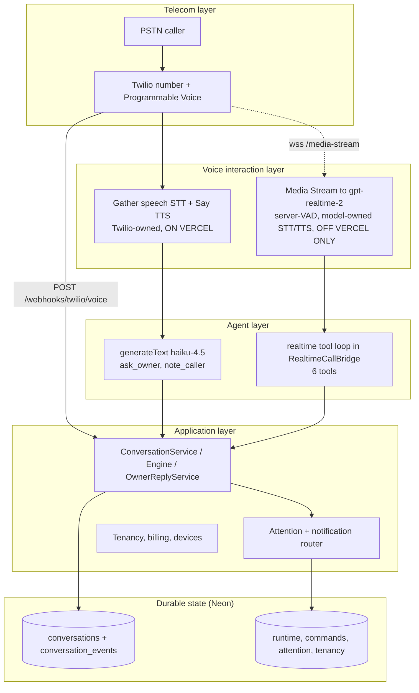
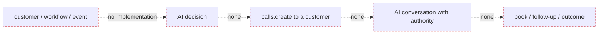
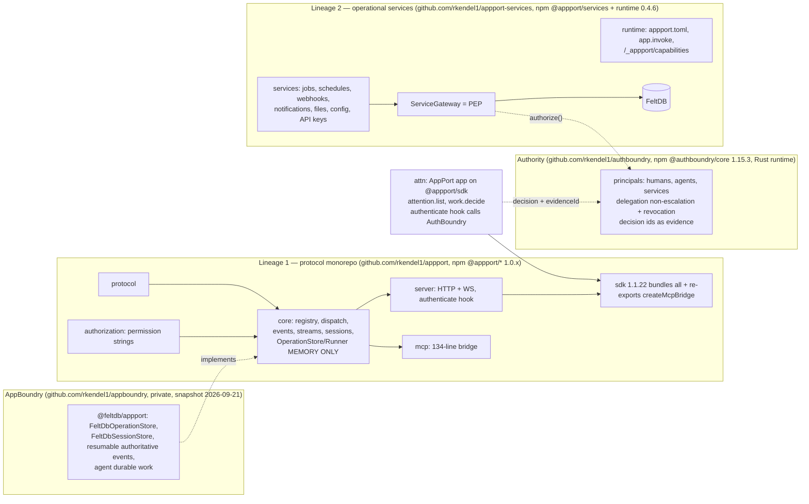
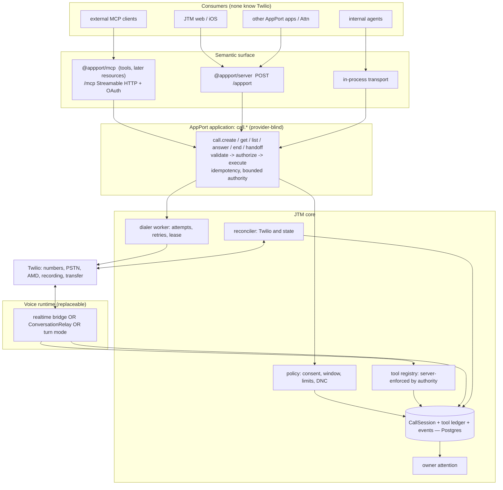

# Just Text Me — Voice Architecture Audit + MCP Path Forward

- **Date:** 2026-09-30
- **Repository audited:** `rkendel1/text-me`, branch `claude/compassionate-sagan-x1vlzv`, HEAD `c455aaf` ("changes")
- **Also inspected (AppPort ecosystem):** `rkendel1/appport` @ `fbae4e0`, `rkendel1/appport-services` @ `dbc91b8`, `rkendel1/appboundry` @ `a160d57`, `rkendel1/authboundry` @ `44f6059`, `rkendel1/attn` @ `00eaa6e`, and the published npm tarballs listed in §19.
- **Nothing in production behaviour was changed.** This is a documentation-only change.

## How to read this document

Every architectural claim carries one of three evidence tags:

- **[code]** — proven by a file in a repository named above (`path:line` or function name).
- **[docs]** — an official external document, cited in §19. **Limitation:** this audit environment's egress proxy blocked direct fetches of `twilio.com`, `ai-sdk.dev`, `vercel.com`, `modelcontextprotocol.io` and `call4.me`; only web search and the npm registry / GitHub were reachable. External-capability claims are therefore taken from the official pages *as surfaced by search results*, not from a full read of each page. Anything that needs a full-page read is marked **Unknown — requires verification**.
- **[inferred]** — my reasoning from the above; labelled so it is never mistaken for a fact.

Line numbers for `src/http-app.ts`, `src/bootstrap.ts` and `src/voice/realtime/call-bridge.ts` were taken from numbered reads. For other files I cite the function name.

---

## 1. Executive summary

**What the product is today.** Just Text Me (JTM) is a multi-tenant "assistant line" SaaS on Express + Postgres (Neon), deployed to Vercel, with Twilio for telephony and the Vercel AI SDK (`ai@^7.0.116`) through Vercel AI Gateway for models. It answers *inbound* calls and texts for an account's owner, escalates to the owner through an attention/notification system, and can move a call to SMS. [code: `package.json`, `src/bootstrap.ts`, `src/http-app.ts`]

**The five findings that matter most.**

1. **The production voice path on Vercel is not the one the docs describe.** The README, `docs/release-audit.md` and `.env.example` describe realtime voice over a Twilio Media Stream bridged to `openai/gpt-realtime-2`. But `src/bootstrap.ts:123-125` deliberately sets `mediaStreamUrl` to `undefined` whenever `process.env.VERCEL` is set, so `TwilioProvider.answerCall` (`src/telephony/twilio-provider.ts:120-148`) falls through to the **turn-based HTTPS path**: Twilio `<Gather input="speech">` + `<Say>`, with the text model (`anthropic/claude-haiku-4.5`, `generateText`) answering each turn from `POST /webhooks/twilio/voice/turn` (`src/http-app.ts:772`). The realtime bridge (`src/voice/realtime/*`) only runs off Vercel. **Documentation and implementation disagree; the implementation is what callers get.** The code comment justifying this ("Vercel Functions do not expose the Node HTTP upgrade event", `src/bootstrap.ts:123`) may now be stale: search results for Vercel's documentation report WebSocket support for Vercel Functions in public beta since 2026-06-22, with a 5-minute default and 30-minute beta ceiling. **Unknown — requires verification** that this fits phone-call durations and this app's entry shape (`src/server.ts` exports only `app`, not the `http.Server` that `realtimeVoice.attach()` upgrades).

2. **There is no outbound AI calling.** The only outbound calls in the codebase are a human-confirmed owner *test call* (`PhoneNumberService.placeTestCall` → `TwilioPhoneNumberClient.placeTestCall`, `src/telephony/phone-number.ts:81-96`, TwiML asks the owner to "Press 1") and a spoken verification code (`callVerificationCode`, `:75-79`). No customer-facing outbound path, no scheduler (`vercel.json` has no `crons`; no job table), no answering-machine detection (explicitly commented out at `:90-93`), no consent/quiet-hours/limits model. The outbound half of the product premise is **unbuilt**, not partially built.

3. **Appointments and follow-ups are prompt text, not capabilities.** `src/integrations/calendar.ts` defines a `CalendarProvider`/`CalendarCapability` but nothing instantiates or calls it (the only other reference is the word "calendar" in `buildInstructions`). The call tools are `note_caller`, `get_owner_context`, `lookup_conversation`, `ask_owner`, `transition_to_text`, `end_call` (`src/voice/realtime/session-config.ts`, `callTools`). "Booking" today means: collect details, call `ask_owner`, relay the owner's answer. That is a sound *escalation* design, but it is not booking.

4. **State is an append-only JSON event log per conversation, and that is both the strength and the ceiling.** `conversation_events(id, conversation_id, type, payload JSONB, occurred_at)` (`src/repositories/postgres-conversation-repository.ts`) holds transcripts, tool activity, SMS, owner messages and call lifecycle. It is durable, tenant-scoped and idempotent on `(provider, provider_call_id)`. But there is no typed call object, no tool-call record with arguments/results, no outcome, no structured follow-up, and every `getById` loads the whole history with no index on `conversation_events(conversation_id)` (only the PK exists).

5. **The AppPort MCP piece that exists is a 134-line in-process bridge, not an MCP server** (§10A). `@appport/mcp@1.0.2` turns a manifest's *request* capabilities into tool descriptors and dispatches `tools/call` through `handleRequest`. It has no JSON-RPC, no transport (no stdio, no Streamable HTTP), no resources, no auth of its own, no notion of long-running operations. That is the *right boundary* (MCP as a projection of AppPort capabilities) with *missing wire plumbing*. It does **not** need a second MCP abstraction; it needs a server adapter, a durable operation store, and a few narrowly-scoped primitives (§10A.5).

**Is the existing architecture good?** Parts of it are genuinely good and should be kept: tenant isolation fail-closed at every route and on background jobs; Twilio signature validation that survives Vercel's proxy; provider-call-id idempotency; durable runtime commands fanned out across instances with Postgres `LISTEN/NOTIFY`; a degraded-assistant path that never returns a 500 to Twilio; the owner-attention model. The weaknesses are (a) the deployment/runtime mismatch above, (b) the absence of a canonical call object, (c) the absence of outbound, and (d) authority being enforced mostly by the prompt for what the model says, while tool *execution* is (correctly) narrow and server-bound.

**Recommendation in one paragraph.** Keep Twilio as the telecom layer and the AI SDK as the model/tool layer. Introduce a durable, provider-neutral **`CallSession`** (inbound and outbound share it). Put the *semantic* call contract — `call.create`, `call.get`, `call.list`, `call.answer`, `call.end`, plus an `attention`-style event — behind **AppPort capabilities** (`@appport/core`), expose them to agents through **`@appport/mcp`** (adding the missing server adapter there, not in JTM), and keep audio/Twilio/STT/TTS entirely inside a **voice runtime** that MCP and AppPort never see. Model the long-running call as **create + get** (AppPort §13.4 operation reference + a tenant-scoped reader), with MCP resources and subscriptions as later projections. Decide the voice-runtime host with a measured spike before any migration. Details, phases and rollback in §16–§17.

---

## 2. Current architecture (as built)

### 2.1 Components [code]

| Concern | Implementation | Evidence |
|---|---|---|
| HTTP server | Express 5, one big app factory (2,573 lines) | `src/http-app.ts`, `src/server.ts` |
| Hosting | Vercel "Fluid compute", `maxDuration: 800` for every function | `vercel.json` |
| Database | Neon Postgres via `pg.Pool({max: 5})`; tables created lazily under an advisory lock | `src/bootstrap.ts`, `src/repositories/schema-lock.ts` |
| Cross-instance signalling | Postgres `LISTEN/NOTIFY` (`conversation_runtime_events`), needs `DATABASE_URL_UNPOOLED` | `src/runtime/event-bus.ts` |
| Telephony | Twilio: incoming-number webhooks, TwiML, REST (`calls.create`, `calls.update`, number search/purchase/update), Verify, Messaging | `src/telephony/*`, `src/messaging/twilio-provider.ts` |
| Text model | AI SDK `generateText` via `createGateway(...)('anthropic/claude-haiku-4.5')`, `stopWhen: isStepCount(4)`, `maxOutputTokens: 400` | `src/conversation/ai-sdk-text-agent.ts` |
| Realtime voice model | AI SDK `gateway.experimental_realtime(...)` over a server-side `ws` WebSocket; **client-driven tool loop** executed by the bridge | `src/voice/realtime/connector.ts`, `call-bridge.ts` |
| Auth (owner-facing) | Bearer sessions (`auth_sessions`, token hash), optional Neon Auth OAuth, tenancy `principal → membership → account → action` | `src/auth/sessions.ts`, `src/tenancy/authorization.ts`, `http-app.ts` (`principal`, `tenant`) |
| Owner notification | `owner_attention` + router to web push / APNs / Mac Messages / SMS | `src/attention/*` |
| Billing | Stripe checkout/portal/webhook | `src/billing/stripe.ts` |
| Calendar | interface only, **unwired** | `src/integrations/calendar.ts` |
| Background jobs | **none** (no cron, no queue). In-process `setTimeout` only for call farewell and LISTEN reconnect | grep: `src/voice/realtime/call-bridge.ts:197,385`, `src/runtime/event-bus.ts` |
| MCP / AppPort | **none** (no dependency, no reference) | `package.json`; repo-wide grep for `appport`/`mcp` = no hits in `src/` |

### 2.2 Environment variables that exist (from `.env.example` and `src/config.ts`) [code]

`DATABASE_URL`, `DATABASE_URL_UNPOOLED`, `NEON_AUTH_BASE_URL`, `TWILIO_ACCOUNT_SID`, `TWILIO_AUTH_TOKEN`, `TELEPHONY_NUMBER_PURCHASE`, `TELEPHONY_SMS_VERIFICATION`, `TWILIO_MESSAGING_SERVICE_SID`, `TWILIO_VERIFY_SERVICE_SID`, `PUBLIC_BASE_URL`, `AI_GATEWAY_API_KEY` (and `AI_GATEWAY_BASE_URL`, `AI_GATEWAY_TEAM`), `REALTIME_MODEL` (default `openai/gpt-realtime-2`), `REALTIME_VOICE_NAME`, `REALTIME_VOICE` (`off` is rejected in production), `TEXT_MODEL` (default `anthropic/claude-haiku-4.5`), `STRIPE_*`, `BILLING_BYPASS_ACCOUNT_ID`, `APNS_*`, `VAPID_*`. Customer-identity variables (`OWNER_PHONE_NUMBER`, `TWILIO_PHONE_NUMBER`, …) are **refused at startup** (`customerIdentityProblems`).

### 2.3 Layered view (who owns what today)



Coupling to note: `RealtimeCallBridge` (499 lines) simultaneously owns barge-in, transcripts, tool execution, owner-command application, hang-up timing and failure attention. The turn path lives *inside `http-app.ts`* (`/webhooks/twilio/voice/turn`, ~180 lines of inline business logic including regex matching of owner instructions like `/call (?:them|you) back/i`, `src/http-app.ts:~845-905`). Those are two different implementations of "the assistant" sharing only `ConversationService`, and the tools differ between them (finding R-10).

---

## 3. Inbound call flow (as built)

### 3.1 Sequence [code]

```mermaid
sequenceDiagram
  autonumber
  participant C as Caller (PSTN)
  participant T as Twilio
  participant V as Vercel fn (Express)
  participant DB as Neon
  participant M as AI Gateway model
  participant O as Owner surfaces
  C->>T: dials assistant line (or carrier-forwarded owner number)
  T->>V: POST /webhooks/twilio/voice (form body, X-Twilio-Signature)
  V->>V: validate signature (public URL + forwarded proto variants)
  V->>DB: resolveLine(To) to account, createIfAbsent(provider, CallSid)
  V->>DB: append call.received / call.answered
  V->>O: raiseAttention(conversation_started) [passive by default]
  alt on Vercel (production)
    V-->>T: TwiML <Gather input=speech action=/voice/turn speechTimeout=auto timeout=5><Say greeting>
    loop each turn (max 20)
      T->>T: Twilio speech recognition
      T->>V: POST /webhooks/twilio/voice/turn?conversationId&turn (SpeechResult)
      V->>DB: load conversation; check runtime (stopped/paused?)
      V->>M: generateText(history, tools ask_owner/note_caller)
      V->>DB: append speech.transcript, ai.response
      V-->>T: TwiML <Gather><Say reply>
    end
  else off Vercel (long-running Node)
    V-->>T: TwiML <Connect><Stream url=wss://.../media-stream><Parameter conversationId> then <Redirect /voice/continue>
    T->>V: WebSocket upgrade (signature checked), start/media/mark/stop
    V->>M: realtime WS via AI Gateway (audio/pcmu 8k, server VAD 600ms)
    M-->>V: audio deltas, transcripts, function calls
    V-->>T: media + mark + clear (barge-in)
  end
  T->>V: POST /webhooks/twilio/status (CallStatus=completed, CallDuration)
  V->>DB: status completed, call.ended; attention conversation_completed
```

### 3.2 Answers to the required "exactly how" questions

| Question | Answer | Evidence |
|---|---|---|
| Twilio products used | Programmable Voice (TwiML webhooks, `<Gather>`, `<Say>`, `<Record>`, `<Connect><Stream>`, `<Redirect>`, `<Hangup>`), Media Streams (off-Vercel only), Programmable Messaging, Verify, phone-number search/purchase/config | `twilio-provider.ts`, `phone-number.ts`, `verification.ts` |
| Number config | Per number: `voiceUrl=${PUBLIC_BASE_URL}/webhooks/twilio/voice` POST, `smsUrl=/webhooks/twilio/sms` POST, `statusCallback=/webhooks/twilio/status` POST. **No voice fallback URL is set.** | `PhoneNumberService.urls()`, `TwilioPhoneNumberClient.update` |
| Webhook routes (all POST) | `/webhooks/twilio/voice`, `/voice/test`, `/voice/turn`, `/voice/continue`, `/voicemail`, `/status`, `/sms`; WebSocket `GET /media-stream` | `http-app.ts:742-993`, `realtime-voice.ts` |
| Speech recognition | On Vercel: Twilio `<Gather input="speech">`. Off Vercel: model-side input transcription (`inputAudioTranscription: {}`, transcription model not specified in code → **Unknown — requires verification** which model the Gateway uses) | `twilio-provider.ts:161`, `session-config.ts` `buildSessionConfig` |
| TTS | On Vercel: Twilio `<Say>` default voice. Off: model audio output (`audio/pcmu`, 8 kHz) | same |
| Model invocation | Text: `generateText`. Realtime: AI SDK Gateway realtime WebSocket; 60-second client token | `ai-sdk-text-agent.ts`, `connector.ts` |
| Tool calls | Turn mode: `ask_owner`, `note_caller` (server `execute`). Realtime: 6 tools, schema-only `tool()` definitions executed by `RealtimeCallBridge.runTool` | `ai-sdk-text-agent.ts`, `call-bridge.ts:333-410` |
| Persistence | Every transcript line, AI reply, tool activity and lifecycle event is an appended row | `appendEvent` calls throughout |
| How the app learns the call ended | Twilio `statusCallback` (`completed` only is parsed; other statuses return 400) and, off-Vercel, stream `stop`/socket close → `voice.completed` | `twilio-provider.ts:75-106`, `call-bridge.ts:475-487` |
| Model/tool failure | Turn mode: catch → `assistant.degraded`/attention `error` + spoken apology + hangup; always valid TwiML. Realtime: `onModelClosed` → `shutdown('failed')` + attention; `/voice/continue` then says "send a text instead" (only if `voice.completed` outcome is `failed`) | `http-app.ts:~920-945`, `call-bridge.ts:458-473`, `http-app.ts:978-990` |
| Interruptible? | Realtime: yes — `speech-started` → Twilio `clear` + `response-cancel` (`call-bridge.ts:225-231, 431-437`). Turn mode: governed by Twilio `<Gather>` barge-in behaviour — **Unknown — requires verification** (not configured in code) | |
| Clarifying questions? | Yes, prompt-driven (`buildInstructions`: "understand, resolve, escalate") | `session-config.ts` |
| Human intervention? | Owner can pause, **take over**, stop, change settings, reply. "Take over" = assistant stops answering and **relays the owner's typed words** ("owner_only"); the human does **not** speak on the call | `call-bridge.ts:126-168`, `owner-reply.ts` |
| Transfer? | **No.** No `<Dial>`, `<Conference>`, SIP or REST `calls.update` with new TwiML. `transferring` exists only as a runtime state label and a voice→SMS "channel transition" | grep: no `dial|conference` in `src/` |
| Recording? | **Only voicemail** (when owner turns off answering) and a dev fallback. `RecordingUrl` stored in an event; no call recording, no Twilio transcription | `http-app.ts:952-976`, `twilio-provider.ts:136-142` |
| Durable vs ephemeral | Durable: conversations, events, runtime, commands, attention, tenancy. Ephemeral: the `RealtimeCallBridge` instance in a `Map` on one process, its WebSocket, in-flight response sets, `playing`, tool-pending sets | `realtime-voice.ts` (`bridges` Map), `call-bridge.ts` |

### 3.3 Inbound premise: does it hold? (required §6 checklist)

| Capability | Status | Notes |
|---|---|---|
| Answered reliably | **Partly** | Webhook path is solid; voice fallback URL not configured; single-region, single function. On Vercel each turn is an independent 15s-bounded webhook [docs: Twilio voice webhook timeout 15 s] |
| Understands the customer | Turn mode: Twilio STT quality, per-turn latency (STT end → webhook → LLM → TTS). Realtime: better, not in production on Vercel | |
| Has customer context | Prior conversations by caller phone only (`priorConversations`, tool `lookup_conversation`, **realtime only**). No CRM/customer entity | `conversation-service.ts:255-263` |
| Answers questions | From the owner's configured introduction/instructions only; no knowledge base | `buildInstructions` |
| Collects information | `note_caller` (name, reason) → event | |
| Takes actions | SMS continuation, owner escalation, hang-up. No booking, no external side effects | |
| Schedules follow-ups | No structured follow-up. "I'll call you back" is a prompt/regex outcome (`/call (?:them|you) back/i`) in turn mode | `http-app.ts:845+` |
| Transfers to a human | No | |
| Creates an owner attention item | **Yes, well done** (`assistant_needs_owner`, dedupe keys, routed to push/APNs/Mac/SMS) | `conversation-service.ts:208-235` |
| SMS follow-up | Yes, consent-gated and idempotent (`sendOnce`) | `conversation-service.ts:270-296` |
| Continue after interruption | Realtime barge-in yes; transcript of the interrupted assistant turn is dropped (R-4) | |
| Recover from tool/API failure | Tool errors become `{error}` tool output and the model continues; model loss → attention + caller told to text | `call-bridge.ts:392-394` |
| Safely handle ambiguity | Prompt-only (`askOwnerWhen`: never/uncertain/important/always) | |
| Durable outcome | Event log only; no outcome field | |
| Owner sees what happened | **Yes** (transcript, activity, attention, live control plane) | |

**Verdict:** the *escalation-centric* inbound premise ("AI handles it, human only when needed") is well served for message-taking and owner-mediated decisions. It is **not** yet served for "takes appropriate action" (no booking/calendar, no transfer) and its production voice quality depends on resolving finding R-1.

---

## 4. Outbound call flow (as built)

**There is no customer-facing outbound flow.** The complete set of outbound Twilio calls [code]:

1. `placeTestCall(accountId)` — rings the owner's verified mobile from their assistant line; TwiML `<Gather dtmf numDigits=1>` "Press 1 to talk to your assistant", then runs the *inbound* code path with the owner as the "caller" (`/webhooks/twilio/voice/test`, `http-app.ts:743-770`). Rate-limited (`testCallLimit`), audited (`phone.test_call_started`), human-only by design ("Twilio's AMD can misclassify a real iPhone pickup", `phone-number.ts:90-93`).
2. `callVerificationCode` — one-way `<Say>` of a 6-digit code.



Consequences for each outbound requirement (§7 of the brief) — all **absent**: initiation API, scheduling, retries, no-answer/busy/voicemail handling, AMD, callback handling, consent/compliance model, call limits, duplicate-call prevention, idempotency for calls, booking tools, calendar integration, customer identity/context, follow-up state, call outcome, outbound escalation, auditability of *outbound authority*. Idempotency and audit patterns that *do* exist (SMS `idempotencyKey`, `audit_events`, runtime `commandId`) are reusable precedents.

**Compliance considerations requiring product/legal review (not legal conclusions).** Search results for the FCC's February 2024 declaratory ruling report that AI-generated voices are "artificial" under the TCPA, implying prior express consent requirements for outbound AI calls to wireless numbers, disclosure and opt-out expectations, and identification of the responsible entity (see §19, FCC/TCPA sources). Twilio documents STIR/SHAKEN attestation, Voice Integrity and Branded Calling for outbound reputation. A `consent` record, calling-window (time-of-day/jurisdiction) rules, do-not-call handling, AI-disclosure wording and recording-consent rules must be product/legal decisions *before* a line of outbound code ships. Nothing in the repository models them today.

---

## 5. Twilio capability audit

Authority: current official Twilio docs (links in §19). Classification per the brief: **U** already used · **A** available, unused · **R** available, needs architectural change · **N** unnecessary for our product.

| Capability | Class | What it would solve for JTM | Notes / cite |
|---|---|---|---|
| Programmable Voice inbound webhooks + TwiML | **U** | Answering | [Voice webhooks](https://www.twilio.com/docs/usage/webhooks/voice-webhooks) |
| `<Gather input=speech>` / `<Say>` | **U** (Vercel path) | Turn-based voice without WebSockets | Latency per turn; barge-in **Unknown — requires verification** |
| Media Streams, bidirectional (`<Connect><Stream>`, `media`/`mark`/`clear`) | **U** (off-Vercel only) | Low-latency realtime audio | [Media Streams](https://www.twilio.com/docs/voice/media-streams), [WS messages](https://www.twilio.com/docs/voice/media-streams/websocket-messages). Bridge correctly uses `mark` to learn when audio was actually heard and `clear` to barge-in |
| Webhook signature validation | **U** | Authenticity | `twilio.validateRequest`; both HTTP and WS handshake validated. Fail-open in WS helper if token/base URL missing (R-8) |
| `calls.update({status:'completed'})` | **U** | Owner "stop" terminates the live call | `twilio-provider.ts:54-56`, `http-app.ts:2218` |
| Status callbacks | **U (minimal)** | Learn call end | Only `completed` is handled; `parseStatusUpdate` throws 400 on any other status. Needed for outbound (`no-answer`, `busy`, `failed`, `canceled`, `ringing`) — [Call resource](https://www.twilio.com/docs/voice/api/call-resource) |
| `<Record>` (voicemail) | **U (narrow)** | Voicemail when answering is off | |
| Verify, Messaging, number search/purchase | **U** | Onboarding / SMS | |
| **Voice fallback URL** | **A** | If `/webhooks/twilio/voice` errors or times out, Twilio can request a fallback URL and play TwiML | Not set by `TwilioPhoneNumberClient.update`. Cheap reliability win. [Voice webhooks](https://www.twilio.com/docs/usage/webhooks/voice-webhooks) |
| **Answering Machine Detection** (`MachineDetection`, `AsyncAmd`, `DetectMessageEnd`) | **A** | Essential for outbound: don't talk to voicemail, or leave a message after the beep | [AMD](https://www.twilio.com/docs/voice/answering-machine-detection). Async AMD lets the callee connect immediately. Accuracy caveats documented; current code declines AMD for owner test calls for that reason |
| **Call recording** (`Record=true`, recording status callbacks, pause/resume) | **A** | Evidence, dispute resolution, QA | [Recordings](https://www.twilio.com/docs/voice/api/recording). Needs consent/retention policy first |
| **Real-time / post-call transcription** (`<Start><Transcription>`, Voice Intelligence) | **A** | Model-independent transcript for evidence | [Transcription](https://www.twilio.com/docs/voice/twiml/transcription). Today transcripts come from the model's own input transcription |
| **`<Dial>` / `<Conference>` / REST redirect** | **R** | Real human handoff/transfer | [Conference](https://www.twilio.com/docs/voice/twiml/conference). Requires the live call to leave the Media Stream/Gather loop and a "who do we ring" model (owner's personal number exists and is verified) |
| **ConversationRelay** (`<Connect><ConversationRelay>`) | **R** | Twilio-hosted STT/TTS + interruption + DTMF, your server only exchanges text over WebSocket | [ConversationRelay](https://www.twilio.com/docs/voice/conversationrelay). Still needs a WebSocket host; removes audio handling (VAD, codec, barge-in) from our code but couples the voice interaction layer to Twilio |
| DTMF (`<Gather dtmf>`, send digits) | **U (test call only)** | IVR navigation for outbound to businesses; confirmation | |
| Conference, Queues, Flex | **N** (for now) | Contact-centre constructs; not the JTM product | |
| SIP / SIP Trunking | **N** (for now) | Only if customers bring PBX | |
| Subaccounts | **Unknown — requires product decision** | Per-tenant isolation/billing/number pools. JTM isolates in the DB, all numbers in one platform account | |
| STIR/SHAKEN, Voice Integrity, Branded Calling | **R** (outbound only) | Answer rates/spam labels for AI-placed calls | [Voice Integrity](https://www.twilio.com/docs/voice/spam-monitoring-with-voiceintegrity), [US voice guidelines](https://www.twilio.com/en-us/guidelines/us/voice) |
| Webhook retry / connection overrides | **A** | Tune retry/timeout on Twilio's side | Per Twilio guidance surfaced in search: voice webhook timeout 15 s, one retry on timeout for some products, configurable via connection overrides. **Unknown — requires verification** of exact per-product behaviour |

**Are we rebuilding something Twilio provides?** Yes, in one place: on the realtime path we implement VAD-driven turn-taking, barge-in (`clear`/`mark` bookkeeping), codec handling and TTS/STT through a third-party realtime model. ConversationRelay provides STT/TTS/interruption as a Twilio feature. That is a *trade-off* (see §14), not an error: the bridge gives model-native speech (one model hears and speaks), ConversationRelay gives text-in/text-out with Twilio-chosen STT/TTS vendors.

---

## 6. Vercel AI SDK audit

Installed: `ai@^7.0.116` (`package.json`; `package-lock` resolves 7.0.116). `node_modules` is not installed in this audit environment, so SDK *types* were not inspected; usage below is from call sites, capabilities from the official docs [docs].

| Dimension | Current usage | Evidence |
|---|---|---|
| Providers | AI Gateway only (`createGateway`), OIDC on Vercel or `AI_GATEWAY_API_KEY`. Models by string id | `bootstrap.ts`, `config.ts` |
| Text generation | `generateText` with server-side `execute` tools, `stopWhen: isStepCount(4)` (multi-step), `maxOutputTokens: 400` | `ai-sdk-text-agent.ts` |
| Streaming | **Not used** for text. Realtime uses the SDK's experimental realtime codec over a raw WebSocket | `connector.ts` |
| Realtime voice | `gateway.experimental_realtime.getToken`, `getWebSocketConfig`, `serializeClientEvent`, `parseServerEvent`, `experimental_getRealtimeToolDefinitions`. The SDK docs describe this primarily as a *browser* flow with a server-minted short-lived token [docs: ai-sdk.dev realtime]; JTM uses it **server-to-server** | `connector.ts`, `session-config.ts` |
| Tool calling | Turn: SDK-executed. Realtime: SDK only supplies *definitions*; execution is our `runTool` switch (the "client-driven loop") | comment in `session-config.ts` |
| Structured output | Not used | — |
| Agent loops (`ToolLoopAgent` etc.) | Not used; bounded `generateText` loop only | — |
| State / persistence | None in the SDK; all in our DB | — |
| Retries / cancellation / `abortSignal` | Not configured explicitly (SDK defaults apply — **Unknown — requires verification**); no cancellation wired to Twilio hang-up | — |
| **MCP client** (`@ai-sdk/mcp`, `createMCPClient`) | **Not used.** Available per docs: stdio / SSE / HTTP transports, OAuth for protected servers, tools from multiple servers | [ai-sdk.dev MCP tools](https://ai-sdk.dev/docs/ai-sdk-core/mcp-tools) |

**Precise answer: is the Vercel AI SDK the voice runtime, the agent runtime, or only model/tool orchestration?**

- For **text**: *model/tool orchestration layer* — one bounded `generateText` call per turn; we own history assembly, persistence and policy.
- For **realtime voice**: *protocol codec and connection factory* to a realtime model through the Gateway. It is **not** the voice runtime. Turn detection config (`server-vad`, 600 ms silence), barge-in, playback accounting, hang-up timing, owner-command application and tool execution are all our `RealtimeCallBridge`. The SDK's realtime module is explicitly marked experimental.
- It is **not** an agent runtime: there is no goal, plan, memory, policy or long-lived session in the SDK; those don't exist in JTM as an "agent" either — they are a system prompt plus six tools.

Limitations imposed by the current implementation: (1) the two voice paths use different tool sets because the tools are defined twice; (2) the AI SDK cannot hold a call across Vercel invocations, so any "agent loop" that spans a call must be durable state + re-entry, which the turn path approximates by replaying the whole event history each turn; (3) no cancellation/timeout coupling between the model call and the 15-second Twilio webhook budget (**Unknown — requires verification** what happens on a slow gateway: the catch path returns a spoken apology, but a hang past Twilio's timeout would surface as a Twilio application error).

---

## 7. Data / state architecture

### 7.1 What is stored and where [code]

| State | Store | Shape | Notes |
|---|---|---|---|
| Call/conversation identity | `conversations` | `id`, `provider`, `provider_call_id`, `caller_phone`, `status` (`received→answered→completed`), `state` (15-value runtime label), `account_id`, timestamps | `UNIQUE (provider, provider_call_id)` makes webhook replay idempotent; `ON CONFLICT DO NOTHING` |
| Everything that happened | `conversation_events` | `type` (35-value union in `src/domain/conversation.ts`), free-form `payload JSONB`, `occurred_at` | No payload schema; **no index on `conversation_id`**; ordering `occurred_at, id` with random ids |
| Live control state | `conversation_runtimes`, `conversation_runtime_overrides`, `conversation_runtime_events`, `runtime_commands` | commands are idempotent on `commandId`; `applied_live` set by the instance holding the call | `src/repositories/postgres-conversation-runtime-repository.ts` |
| Owner attention | `owner_attention` (`UNIQUE(account_id, dedupe_key)`), `notification_deliveries`, `owner_surface_devices` | dedupe keys make raises idempotent | `src/attention/postgres.ts` |
| Tenancy | `users`, `accounts`, `memberships`, `phone_numbers` (unique partial indexes on active numbers), `planes`, `subscriptions`, `audit_events` | | `src/tenancy/postgres.ts` |
| Sessions | `auth_sessions` (token hash) | | `src/auth/sessions.ts` |
| Live call bridge | In-process `Map<conversationId, RealtimeCallBridge>` | ephemeral | `realtime-voice.ts` |

### 7.2 Durable vs ephemeral

- **Durable:** all of the above tables. Transcripts are written per turn, so a crash loses at most the in-flight turn.
- **Ephemeral:** the bridge, the Gateway WebSocket, playback/response bookkeeping, `toolOutputsPending`, farewell timers. Commands fan out across instances via `LISTEN/NOTIFY` (at-most-once) but are **also** persisted, so an offline instance can recover them [code: `runtime_commands`; test `vercel-runtime.test.ts` "fresh instance recovers live state from Neon"].

### 7.3 What does *not* exist (the canonical-object gap)

There is no single record that answers "what was this call, what was it for, what did the AI do, what was the outcome, what follow-up is owed, what is the evidence". Those facts are *derivable* by scanning `conversation_events`, which is why `priorConversations`, `voiceSummary` (`conversation-service.ts:265`: "the first `speech.transcript`'s text") and `openOwnerRequest` are all ad-hoc event scans. A typed `CallSession` (§14) is the missing join.

---

## 8. Security and authority audit

Keep five things separate: **authentication** (who), **authorization** (may they), **agent instructions** (prompt), **tool permissions** (what the model can cause), **business rules** (policy).

| Question | Answer | Evidence |
|---|---|---|
| What authorizes an *outbound* call? | **Nothing exists.** | §4 |
| What authorizes the AI to speak for the business? | The account owner configuring an assistant line and turning on `answerCalls`; the prompt names the owner. There is no per-call authority object | `OwnerConfiguration`, `buildInstructions` |
| What authorizes access to customer information? | The call runs "as its conversation's account" (`call-bridge.ts:80-81`); `lookup_conversation` is filtered by `account_id` **and** caller phone | `conversation-service.ts:255-263` |
| What authorizes booking/changing appointments? | No such action exists. `allowScheduling=false` only adds a prompt line | `session-config.ts` |
| What prevents arbitrary tool use? | The model can only emit calls to the six declared tools; unknown names return `{error}` (`call-bridge.ts:389-391`). **Server-enforced**: tool arguments never choose a destination or account | |
| Can the model bypass restrictions? | Restrictions that are *only prompt text* (`allowCommitments`, `allowScheduling`, `allowCallerFollowups`, `requireSmsConsent`, "never mention being an AI") are **not enforced in code** and can be bypassed by model error or caller manipulation. Restrictions enforced in code: tenant scoping, `transition_to_text` sends only to the Twilio-provided `From` number (`continueOverText` uses `conversation.callerPhone`), one SMS per idempotency key, `smsTransitionEnabled` checked server-side (`call-bridge.ts:413`) | |
| Can an inbound caller cause unauthorized actions? | The action surface is small. Realistic abuse: (1) induce `transition_to_text` → an SMS to *their own number* (cost/harassment-neutral, consent is model-judged, R-11); (2) induce `ask_owner` → attacker-chosen text is delivered to the owner's phone/SMS via `OwnerSmsSurface` (phishing-shaped content in a trusted channel); (3) `note_caller` writes attacker-chosen name/reason into events/notifications | |
| Prompt injection from caller | Caller speech is fed to the model as normal input; there is no separate "untrusted" channel. **Safe only because the tool surface is narrow.** It will stop being safe the moment booking/transfer/outbound tools are added unless those tools enforce authority server-side | |
| Customer-provided instructions untrusted? | `customInstructions` come from the *owner* (authenticated `settings.manage`), not the caller. Caller content is not sanitized before reaching owner UIs — **Unknown — requires verification** whether `presenters`/`public/index.html` escape all payload fields | |
| Twilio webhooks authenticated? | Yes: HTTP (`http-app.ts:717-737`: public-URL and forwarded-proto variants) and WS handshake (`realtime-voice.ts` `verifyTwilioSignature`). `twilioAuthToken` is a production requirement (`PRODUCTION_REQUIREMENTS`) | |
| MCP requests authenticated? | No MCP in JTM | |
| Authorization separate from authentication? | **Yes, well done** for owner APIs: `principal` (session) → `tenant(action)` → membership re-checked on each request → `authorize(context, action)`; roles owner/admin/member; fail-closed; cross-tenant ids return 404 | `src/tenancy/authorization.ts`, `http-app.ts` |
| Background work carries its tenant? | Yes: `TenantJob`, `assertJobOwnership`, commands carry `accountId` and the bridge ignores other accounts' commands (`call-bridge.ts:129-132`) | |
| Outcomes/evidence persisted? | Transcript and tool activity yes; no signed/structured outcome evidence, no decision record | |

**Trust boundary summary.** Today the model's blast radius is bounded by *what tools exist*, not by *a granted authority*. That is an acceptable design for a message-taking assistant and an unacceptable one for an agent that can place calls and change appointments. Bounded authority must become data on the call (§14) and be enforced by the tool dispatcher, never by the prompt.

---

## 9. Reliability audit

Severity reflects what the code substantiates. "Plausible" means the mechanism is real but I did not reproduce it.

| ID | Finding | Evidence | Impact | Direction |
|---|---|---|---|---|
| **R-1** | Production-on-Vercel uses turn-based Gather/Say; docs claim realtime | `bootstrap.ts:123-133,182`; README "Voice is a transport… `<Connect><Stream>`"; `docs/release-audit.md:16,36` | Latency and naturalness materially differ from what was designed/tested (`test/realtime-voice.test.ts` tests only the realtime path); behaviour differs between environments | Decide runtime host by measurement (§13); until then correct the docs |
| **R-2** | Turn mode delivers an owner's answer only on the **next Gather callback** | `http-app.ts:~800-830` (`queued_for_voice`) | After `ask_owner` the caller must speak or hit the 5 s `timeout` for the answer to be voiced; the assistant cannot "keep them company" as the prompt promises | Needs realtime/ConversationRelay, or `calls.update` to redirect the live call to new TwiML when the owner replies |
| **R-3** | Instance dies mid-realtime-call → no `voice.completed` → `/voice/continue` hangs up **silently** (it only apologizes when outcome is `failed`) and raises no attention | `realtime-voice.ts` `realtimeVoiceStatus`; `http-app.ts:978-990` | Caller hears nothing, owner not told | Treat "stream ended without `voice.completed`" as failure in `/continue`; add a reconciler (R-7) |
| **R-4** | Interrupted assistant turns are not transcribed, and the model is not told what was actually heard | `silence()` clears `allowedResponses` (`call-bridge.ts:431-437`), later `*-transcript-done` is dropped (`:247-250`); no `truncate` anywhere (`grep -ri truncate src` empty) | Transcript omits partial assistant speech; the model believes it finished sentences the caller never heard | Record partial text at `clear`; send item-truncate to the model |
| **R-5** | Check-then-append dedupe is not atomic | `engine.respond` (`existingTranscript` scan then append); `/voice/turn` (`events.some(callbackId)` then append) | Twilio retries a voice webhook on timeout [docs, search-surfaced]; concurrent retries can double-record a turn or double-answer. **Plausible** | Unique index on `(conversation_id, payload->>'callbackId', type)` or an `idempotency_key` column |
| **R-6** | `conversation_events` has no `(conversation_id, occurred_at)` index and every read loads all events; `list()` issues one events query per conversation | `postgres-conversation-repository.ts` (`getConversationWithEvents`, `list`) | Cost grows with history; a long call triggers many full reloads (`requireConversation` is called repeatedly per tool/turn) | Add index; add `getEventsSince`; stop reloading in hot paths |
| **R-7** | No reconciler for orphaned/stuck calls. A conversation stays `answered` until Twilio's `completed` callback; if that callback is lost or returns non-2xx forever (note: non-`completed` statuses return **400**), nothing ever fixes it | `twilio-provider.ts:105` (`throw 400`), `ConversationService.updateCallStatus` | Stuck "live" calls in the control plane; `attention` never resolved | Fetch call state from Twilio REST on a timer for `answered` older than N minutes; accept and ignore unknown statuses with 200 |
| **R-8** | `verifyTwilioSignature` returns `true` when token/base URL are absent | `realtime-voice.ts` (`if (!options.twilioAuthToken || !options.publicBaseUrl) return true`) | Only reachable in dev composition (production requires the token) — low | Fail closed when `production` |
| **R-9** | No entitlement/quota check when a call arrives; realtime has no maximum duration | `registerIncomingCallRoute` (no subscription check); `call-bridge.ts` only has a 10 s farewell timer | An unpaid/cancelled account's line still spends model minutes; unbounded call cost | Gate on plane/subscription; per-call and per-account minute caps |
| **R-10** | **Prompt references tools that don't exist in turn mode.** `contextFor(..., 'voice')` builds `buildInstructions(…, 'voice')`, which tells the model to call `transition_to_text` and `lookup_conversation`; `AiSdkTextAgent` only defines `ask_owner` and `note_caller` | `session-config.ts` `buildInstructions` (lines 124-130 of that file), `ai-sdk-text-agent.ts` tool block | On Vercel the assistant may *offer* SMS continuation it cannot perform | One tool registry shared by both paths |
| **R-11** | SMS consent is *model-asserted*: `transition_to_text` → `grantSmsConsent` records consent with no caller-utterance evidence; "only after the caller clearly says yes" is prompt text | `call-bridge.ts:380-382,412-421`; `session-config.ts` | Consent audit trail is weak (TCPA/CTIA-sensitive; needs legal review) | Persist the consenting utterance + timestamp as evidence; make consent a server-verified precondition |
| **R-12** | No voice fallback URL on the number | `TwilioPhoneNumberClient.update` | If the app is down/cold-fails, caller hears Twilio's error message instead of "please text" | Set `voiceFallbackUrl` to a static TwiML (Function/Bin) |
| **R-13** | Voice→SMS transition not atomic: SMS may send then the DB write fail (or the reverse) | `convertToTextConversation` | `sendOnce` guards duplicates by scanning for `sms.sent` with the key, so a retry is safe; a crash *between* send and event append can double-send once. **Plausible, low** | Insert a pending `sms.sent` row first (outbox) |
| **R-14** | Webhook handlers mutate multiple rows without a transaction (`answerCall` + `recordEvent` + `raiseAttention`) | `registerIncomingCallRoute` | Partial state on crash; mostly self-healing by idempotent re-entry | Acceptable; note for CallSession design |

Things the code gets **right** that should not be regressed: signature check behind a proxy (verified by test per `docs/release-audit.md` row 1); provider-call-id uniqueness; unknown number → `notInService` TwiML and no conversation; command idempotency and "settled replay"; attention dedupe keys; degraded assistant path; `unhandledRejection` logging so one call cannot crash the instance (`src/server.ts`).

---

## 10. MCP investigation (protocol facts)

What the MCP specification provides, as surfaced from official spec pages (§19) [docs]:

- **Roles.** Hosts/clients/servers; servers expose **tools** (model-invoked actions), **resources** (readable context, addressable by URI) and **prompts**.
- **Transports.** stdio and **Streamable HTTP** (HTTP POST for client→server messages, optional SSE for streaming). Credentials are per-request input, not connection state; tool availability *may* vary by the authorization presented.
- **Authorization.** A protected MCP server is an **OAuth 2.1 resource server**: it MUST publish OAuth 2.0 Protected Resource Metadata (RFC 9728) so clients can discover the authorization server, then clients run an authorization-code flow with PKCE; servers validate audience-bound tokens.
- **Long-running work.** *Tasks* were introduced in spec revision 2025-11-25 and are described as **experimental**; *elicitation* lets a server ask the user for input mid-operation. A newer revision dated 2026-07-28 also appears in search results. **Unknown — requires verification** which revision is current for our clients and whether Tasks have stabilised.
- **What MCP is not.** It is not a state store, not a workflow engine, not an authorization model for *business* actions. It carries tool calls and context.

What this means for a phone call: a tool call that *returns quickly with an identifier* and is followed by reads is supported by every MCP revision; anything that depends on Tasks, elicitation or resource subscriptions is a client-capability gamble today. The design must degrade to "tools that return IDs and statuses".

**Does MCP add unnecessary complexity for JTM?** As an *internal* boundary between JTM's own web app and its own call service: yes, it does — JTM already has a tenant-scoped REST API and does not need JSON-RPC between its own components. As an **external integration surface** ("let any agent ask the business to call a customer, and watch the result"): it is exactly the reuse point, and the reason to use it is that the client ecosystem already speaks it, not that it is architecturally purer.

---

## 10A. Existing AppPort MCP Capability

> Instruction from the owner of this work: **do not create a second MCP abstraction.** Everything below is about what already exists and the smallest additions to it.

### 10A.0 The ecosystem map (it is larger than one package)

I first inspected only `@appport/mcp` and `@appport/core`, then enumerated everything published or cloned. The "AppPort" name currently covers **two parallel lineages that do not depend on each other**:



Evidence for the "two lineages" claim [code]: `grep` for `@appport/core|protocol|mcp|server|sdk` across `appport-services` returns **no imports or dependencies**; its `package.json` depends only on `express`, `@feltdb/core`, `@iarna/toml`, `express-rate-limit`. Its `invoke` is `invokeService(services, capability, input, {principal})` with `principal` a *branded* verified principal — a different execution model from `@appport/core`'s `handleRequest(request, {session})`. `@appport/mcp` only accepts an `AppPortApplication` from `@appport/core`. **So today, `@appport/mcp` cannot project `appport()` (runtime) applications, and the durable services (jobs/schedules/webhooks) are not reachable through it.**

Packages found (verified in the registry unless noted) [code/registry]:

| Package | Version | What it is | Relevance to calls |
|---|---|---|---|
| `@appport/protocol` | 1.0.2 | envelopes, manifest, errors, `OperationRecord`/`OperationRef` types | contract types |
| `@appport/core` | 1.0.3 | dispatch pipeline, registry, `EventBus` (at-most-once), streams, `SessionStore`, `IdempotencyStore`, **`OperationStore` interface + `MemoryOperationStore` + `OperationRunner` + `createOperationCapabilities`** | the operation contract for long-running work |
| `@appport/server` | 1.0.2 | HTTP + WebSocket bindings; `authenticate(request) → {session, principal}` hook | per-request identity |
| `@appport/authorization` | 1.0.2 | permission strings, `AuthorizationContext` (`has/hasAll/require`) for handler-level checks | capability permissions |
| `@appport/mcp` | 1.0.2 | the bridge | MCP projection |
| `@appport/sdk` | 1.1.22 | bundles the above; re-exports `createServer`, `createMcpBridge` | what apps import (Attn does) |
| `@appport/services` / `@appport/runtime` / `create-appport` | 0.4.6 / 0.4.6 / 0.1.9 | durable jobs (leases, retries, **re-authorization on every run, principal captured at enqueue, optional AuthBoundry delegation**), schedules, webhooks (durable delivery/replay/receive), notifications, files, config; FeltDB-backed | scheduling/retry of outbound calls; durable webhook receive |
| `@authboundry/core` / `bridge` | 1.15.3 / 0.1.3 | authority boundary; humans, agents, services as principals; "delegation cannot grant authority the delegator does not possess"; revocation | "who authorized the AI to call" |
| `@feltdb/appport` (private, in `appboundry`) | 0.1.0 | `FeltDbOperationStore`, `FeltDbSessionStore`, authoritative resumable events with durable cursor, agent durable work | proves the durable-operation store is an *adapter*, not a core change |
| `attn` (private) | — | an AppPort application: `attention.list`, `work.list`, `agents.list`, `ideas.list`, `work.decide`; AuthBoundry `authorize(...)` inside the server `authenticate` hook returning principal, tenant, permissions, `evidenceId` | reference consumer; destination for owner attention |

### 10A.1 What `@appport/mcp` provides today

`packages/mcp/src/index.ts` (134 lines) and the identical published `dist/index.js` (1.0.2; 1.0.0 → 2026-09-21, 1.0.1 → 09-24, 1.0.2 → 09-28) [code]:

- `toToolName(capability, prefix?)` / `fromToolName(tool, prefix?)` — dots ↔ underscores, 64-char cap.
- `toMcpTools(manifest, options)` — every capability with `kind === "request"`, excluding reserved `appport.*` unless `includeBuiltins`, optionally filtered by `include(entry)`; each tool = `{name, description, inputSchema, _appport:{capability, version, authorization, outputSchema}}`.
- `createMcpBridge(application, dispatch, options)` → `{ listTools(), callTool(name, args) }`. `callTool` resolves the tool, builds a request with a fresh `requestId` and the capability's **latest** version, and runs `application.handleRequest(request, { transport: "mcp", ...dispatch })`. `ok:false` → `{isError:true, content:[text "CODE: message"]}`; success → one text item containing `JSON.stringify(output, null, 2)`.
- `describeError`.
- 5 tests (`bridge.test.ts`): name mapping, schema exposure, dispatch, **authorization preserved** (reader session gets `FORBIDDEN`), validation (`INVALID_INPUT`).

It is re-exported by `@appport/sdk`. The doc claim (README, `docs/protocol-surface-discovery-proof.md` in `appboundry`) is that MCP is "one more projection of the same declared capabilities, with the same schemas and the same authorization requirements" — and **the code supports that claim** for request capabilities. The proof doc is itself candid that "no MCP adapter was built".

### 10A.2 Answers to the 17 questions

| # | Question | Answer (evidence) |
|---|---|---|
| 1 | What does it do today? | In-process projection of request capabilities to tool descriptors + dispatch (above) |
| 2 | MCP protocol/version? | **None declared and none implemented at the wire level.** No JSON-RPC, no `initialize`. The only MCP-protocol mention in the ecosystem is `appboundry/external/mcp-invoice` ("protocol 2024-11-05", stdio) — a *provider fixture* the harness calls, not `@appport/mcp` |
| 3 | Transports? | **None.** README: "Wire `listTools` and `callTool` into an MCP server implementation." `conformance/README.md` lists "MCP transport" under Level 5 "Runtime-specific … (not tested by this suite)" — i.e. planned, absent |
| 4 | Exposes AppPort capabilities as MCP tools? | **Yes** — that is its whole purpose (package description) |
| 5 | Remote MCP? | **No**, not as shipped |
| 6 | Streamable HTTP? | **No** |
| 7 | Authentication/authorization? | The bridge authenticates nothing. It passes `DispatchOptions` (`session`, `principal`) **fixed when the bridge is created**; AppPort core then does validate → authorize (capability permission strings) → execute. `@appport/server` has a per-request `authenticate(request)` hook (used by Attn) but nothing connects MCP OAuth tokens to it |
| 8 | How are contracts represented? | Name, description (manifest text, else generated), `inputSchema` = the capability's published JSON Schema, non-standard `_appport` annotation (capability, **latest** version, required permissions, output schema) |
| 9 | Inputs/outputs derived? | Input: straight from the manifest. Output: `JSON.stringify` in a single `text` content part; the output schema is only in `_appport`, not in MCP's own output-schema/structured-content fields (**Unknown — requires verification** which MCP revision defines those and whether our target clients consume them) |
| 10 | Resources/state in addition to tools? | **No.** No resources, no prompts. Stream capabilities are filtered out (`kind === "request"` only) |
| 11 | Sessions? | One AppPort `Session` object bound for the bridge's lifetime. No MCP session (`Mcp-Session-Id`) concept |
| 12 | Long-running operations? | **Not in `@appport/mcp`.** They live in core (AppPort spec §13.4): capability returns `{operationId, status}`; `operations.status`, `operations.cancel` (request capabilities) and `operations.events` (stream). Core's store is **memory-only** (`MemoryOperationStore`); `OperationRunner` runs work in-process with an `AbortController` |
| 13 | Async operation status? | Via `operations.status` — which, not being `appport.*`, **would** be exposed by the bridge as a tool [inferred from the filter]. `operations.events` would **not** (stream) |
| 14 | Events/subscriptions? | Core has `EventBus` and `subscribe` envelopes, delivery **at-most-once** and explicitly "not durable messaging" (spec §11.1). The bridge exposes none of it |
| 15 | Preserves capability/contract semantics? | Mostly — with two important **leaks**: (a) `createRequest` is called with only `requestId`, `capability`, `input`: **no `idempotencyKey`, no `timeoutMs`, no `traceId`**, so AppPort's idempotency guarantee (§13.1) is **unreachable through MCP** — fatal for `call.create` (duplicate calls); (b) only the latest version is addressable, silently |
| 16 | What must be added for a long-running phone call? | §10A.5 |
| 17 | What must not be added? | §10A.6 |

Additional defects to know about (all small): `fromToolName` replaces *every* underscore with a dot, so a capability whose name contains `_` does not round-trip, and the 64-character slice can collide — **capability names used for calls must contain no underscores** (the bridge's own `callTool` looks tools up by the generated name and is unaffected; only the helper is). Spec-section references are inconsistent (`mcp/src` says §65, `operations.ts` says §47, but `spec/appport-1.0.md` has 24 sections and long-running operations are §13.4). `appboundry/docs/architecture/public-package-boundary.md` says `@appport/core` "is not public" and `@appport/mcp` is "Internal/deferred", yet both are on npm — the registry, not the doc, is authoritative. `PUBLISHING.md` lists `@appport/mcp (1.0.1)` while 1.0.2 is published. `appport-services/docs/architecture.md` still lists webhooks/jobs as "deliberate non-goals", contradicted by the README and code.

### 10A.3 What Just Text Me can use immediately

1. **`@appport/protocol` + `@appport/core`** to declare `call.*` capabilities (validated input/output schemas, declared permissions, idempotency `supported`, concurrency policy `keyed(callId)`), with the dispatch order validate → authorize → execute for free.
2. **`@appport/server`'s HTTP binding and `authenticate` hook** to put the same capabilities on `POST /appport` without writing another REST surface; map a JTM bearer session to an AppPort `Session` whose `permissions` come from `TenantAction` (e.g. `conversation.control` → `call.read`/`call.answer`/`call.end`; `phone.manage` → `call.create`).
3. **`@appport/mcp`'s bridge** (via `@appport/sdk` or directly) as the projection layer — per authenticated request, `createMcpBridge(application, { session })` (cheap: it re-reads the manifest each call).
4. **The `OperationStore` interface** — implement it over Neon (≈80 lines; the FeltDB version in `appboundry/integrations/feltdb/src/operations.ts` is the template and shows it is an adapter: `create/get/update/list/subscribe`).
5. **Design patterns, not dependencies, from `@appport/services`:** a job's durable principal captured at enqueue and re-authorized on each run; `delegationId` checked by the authority at each execution. Adopting the package itself would bring FeltDB and AuthBoundry as hard dependencies (§10A.4).

### 10A.4 Current limitations that matter for calls

- No MCP server/transport/OAuth (biggest gap).
- Idempotency and timeout not plumbed through `callTool`.
- Operations are in-memory in the public core; durable store is in a **private** FeltDB integration. The `OperationStore` interface is public, so JTM can supply its own.
- `createOperationCapabilities` authorizes with a **flat permission list**: `operations.status({operationId})` returns *any* operation for any caller who holds that permission. In a multi-tenant product that is a **cross-tenant read**. The handler has no per-record ownership hook. JTM must not register the generic `operations.*` capabilities as-is (§10A.5 item 4).
- `OperationStatus` is coarse: `pending | running | succeeded | failed | cancelled`. A call also *waits for input*; fine-grained phase must ride in `attributes`/`call.get`.
- Events are at-most-once; cannot be a source of truth; must only be a hint to re-read state.
- No per-invocation **delegated/bounded authority**: a `Session` carries `permissions` for its whole life. "This agent may place *this* call about *this* goal and may only book an appointment" is not expressible in the session; it must be **input data validated by the handler**.
- `@appport/services` (jobs, schedules, durable webhooks) is unreachable from `@appport/core` and needs FeltDB + AuthBoundry.

### 10A.5 What would have to be added to support a long-running phone call — smallest changes

| # | Missing primitive | Smallest change | Belongs in |
|---|---|---|---|
| 1 | A real MCP **server adapter** (JSON-RPC `initialize`/`tools/list`/`tools/call`, Streamable HTTP, `WWW-Authenticate` + protected-resource metadata, token→`Session`) | A thin `createMcpHttpHandler({ application, authenticate })` **inside `@appport/mcp`** built on the official MCP TypeScript SDK (not reimplementing JSON-RPC), calling the existing bridge per request. JTM mounts it at `/mcp` | **`@appport/mcp`** |
| 2 | Idempotency/timeout/trace through tool calls | `callTool(name, args, meta?)`; accept `_meta.idempotencyKey` (or a reserved optional `idempotencyKey` argument added to the tool schema when the capability declares `idempotency: "supported"`) and pass `idempotencyKey`, `timeoutMs`, `traceId` into `createRequest` | **`@appport/mcp`** |
| 3 | Structured output | Also return `structuredContent` (+ `outputSchema` in the descriptor) when the MCP revision in use supports it; keep the text fallback | **`@appport/mcp`** |
| 4 | Tenant-scoped operation reads | Optional `access(record, authorizationContext)` predicate in `OperationCapabilityOptions` so `operations.status/cancel/events` can refuse records the caller may not see. *Alternative with no core change:* do not register `operations.*`; expose `call.get` / `call.end` (which scope by account) and return an `OperationRef`-shaped `{operationId, status}` from `call.create` | **`@appport/core`** (one option) or JTM (no change) |
| 5 | Durable operation store on the product's own DB | `PostgresOperationStore implements OperationStore` **or** make the CallSession table *be* the store. Externally driven state (Twilio webhooks) should call `store.update()` directly; `OperationRunner` (in-process work + `AbortController`) is the wrong shape for a call held by Twilio | **Just Text Me** |
| 6 | Bounded authority per call | Not a protocol change: `authority` is **input** of `call.create`, persisted on the CallSession, validated by the handler (caller may only grant actions they hold permission for — same non-escalation rule AuthBoundry enforces for delegation), and enforced by the voice runtime's tool dispatcher | **Just Text Me** (+ AuthBoundry later) |
| 7 | Long-poll for MCP clients without push | `call.get({callId, waitSeconds<=20})` — stays a request/response capability, bounded below `timeoutMs` | **Just Text Me** |
| 8 | Resources / subscriptions (`call://{id}`) | *Deferred.* If needed later: map a capability read to an MCP resource template in `@appport/mcp`; map AppPort `subscribe` to `resources/subscribe` as a **wake-up hint** only | **`@appport/mcp`** (later) |

### 10A.6 What must **not** be added to `@appport/mcp`

Anything about audio, Twilio, STT/TTS, WebSockets, voice models, barge-in, dial/AMD/retry policy, consent or calling-window rules, call state machines, transcript storage, tenant/billing logic, or a product-specific tool list. `@appport/mcp` must remain a *projection of declared capabilities*; it gets **no** knowledge of what a capability does. If `@appport/mcp` ever needs the word "Twilio", the boundary has failed.

**Answer to "does MCP need to know anything about audio/Twilio/STT/TTS/WebSockets/voice models?" — No.** Correct separation:

```
MCP client ──tools/call──▶ @appport/mcp ──handleRequest──▶ AppPort `call.*` capability
                                                               │ (semantic: objective, authority, recipient, outcome)
                                                               ▼
                                          JTM CallSession (Postgres) ◀──state──▶ Voice runtime ──▶ Twilio ──▶ phone
```

### 10A.7 Is `AI → MCP → @appport/mcp → AppPort contract → JTM → call capability → Twilio` the right architecture (vs a bespoke API)?

**Yes for the external/agent-facing surface, with the caveats above; no for JTM's own internal plumbing.** Reasons (all evidence-based):

- The bridge already guarantees the property that matters — *the same validation and authorization run for a tool call as for any other request* — and that property is covered by its tests.
- Attn is an existing application shaped exactly like this (`defineCapability` → `createServer({authenticate})` → AuthBoundry decision with `evidenceId`), so a second AppPort consumer of the same pattern already exists.
- A bespoke "JTM call API for agents" would have to reinvent schema publication, versioning, idempotency, error codes, authorization declarations, and a manifest — all of which AppPort already defines.
- JTM's *own* web UI does **not** need to move to AppPort in order to benefit. Keep the Express control-plane routes; add the `call.*` AppPort application as a facade over the same services.

### 10A.8 Should it be `phone.call`? Deriving the name from AppPort conventions

Observed conventions [code]: `<resource>.<verb>` in lower-case dotted names with no underscores (`documents.save`, `todo.create`, `build.start`, `build.logs`, `operations.status`, `attention.list`, `work.decide`, `agents.list`); reserved `appport.*`; versioned `name@N`; breaking changes → new version. Reads are `list/get`, mutations are verbs, human decisions are explicit verbs (`work.decide`).

Therefore: **the resource noun should be the domain concept, not the provider or transport.** `phone` is a transport-flavoured noun; `call` is the semantic one and matches `work`, `attention`, `documents`. I propose the namespace **`call`** (tool names `call_create`, `call_get`, …). "phone.call" is acceptable only if the owner wants a "device/channel" namespace with `sms.*` siblings; that is a product-taxonomy decision (§18, open question 3). Avoid underscores in capability names (`call.answer`, not `call.answer_question`).

### 10A.9 Proposed `call.*` contract (v1)

| Capability | Kind | Permission | Idempotent | Purpose |
|---|---|---|---|---|
| `call.create@1` | request → `{callId, operationId (=callId), status}` | `call.create` | **supported** (required) | Start an **outbound** call with an objective, context refs and bounded authority. Returns immediately |
| `call.get@1` | request | `call.read` | n/a | Canonical state: `status`, `phase`, `direction`, `recipient`, `objective`, `transcript` (paged/cursor), `openQuestions[]`, `outcome`, `followUp`, `evidence`. Optional `waitSeconds` long-poll |
| `call.list@1` | request | `call.read` | n/a | Filter by direction/status/customer/time; **includes inbound** calls |
| `call.answer@1` | request | `call.answer` | supported | Answer an open question (the owner/agent supplies the decision; the runtime relays it) — replaces "owner reply" for agents |
| `call.end@1` | request | `call.control` | supported | Cancel a not-yet-answered call or hang up a live one (maps to Twilio `calls.update`) |
| `call.handoff@1` | request | `call.control` | supported | **Later.** Transfer to a human number/owner; requires the Twilio `<Dial>` path (not built) |
| `call.changed@1` | event | `call.read` | — | At-most-once *hint* "re-read `call.get`" (spec §11.1: never a source of truth) |

What is deliberately **not** in the contract: Twilio SIDs, `from` numbers, AMD flags, codecs, voices/models, webhook URLs.

```ts
// Shape only (illustrative, not implementation)
call.create input = {
  recipient: { customerId } | { e164, consentRef },   // never a free-form number without a consent reference
  objective: string,                                  // "Confirm Thursday's appointment; offer to reschedule"
  context:   { refs: EntityRef[], summary?: string }, // server-resolved; model never fetches by id
  authority: {
    allow:  ('discuss'|'schedule.followup'|'appointment.propose'|'appointment.book'|'message.send')[],
    deny?:  string[],                                 // explicit "no purchases / no account changes / no PII disclosure"
    maxDurationSec, maxAttempts, window: { notBefore, notAfter }, voicemail: 'leave'|'skip'
  },
  disclosure: 'ai_identified',                        // product/legal-defined
  idempotencyKey                                      // from the AppPort envelope, not the input
}
```

### 10A.10 Compare the four long-running models (A–D)

| Model | Shape | Fit with AppPort | Fit with MCP (as implemented) | Verdict |
|---|---|---|---|---|
| **A — synchronous tool** `call()` → result | Holds a request open for minutes | **Violates** spec §13.4 ("MUST NOT hold a transport open"); `timeoutMs` ≠ cancellation | MCP clients time out on long tool calls; Vercel/Twilio budgets are far shorter | **Rejected** |
| **B — create + get** | `call.create` → `{callId, status}`; `call.get(callId[, waitSeconds])` | **Exactly** AppPort's operation pattern (`{operationId, status}` + a status reader); idempotent create; cancellation via `call.end` | Works with today's bridge (tools only) once idempotency is plumbed | **Adopt as the contract** |
| **C — create + resource** `call://<id>` | Same, plus an MCP resource for state/transcript | AppPort has no "resource" primitive; it would be a read projection | The bridge has no resources; needs new work in `@appport/mcp` and client support | **Later**, as a *projection* of `call.get`, not a new contract |
| **D — create + resource + events** | Adds push | AppPort events are at-most-once; `operations.events` is a stream (excluded by the bridge); MCP subscriptions/Tasks/elicitation depend on client support (**Unknown — requires verification**) | Not expressible through the current bridge | **Later**, and only as a wake-up hint over B |

**Decision:** Model **B**, with a bounded `waitSeconds` on `call.get` so clients without push can still be efficient. No bespoke protocol is needed.

### 10A.11 Inbound: is the call itself an AppPort capability/session?

Separate four things explicitly:

| Plane | Inbound | Outbound |
|---|---|---|
| **Control-plane API** (what an agent/app may *request*) | `call.get/list/answer/end/handoff` — **no `call.create` for inbound**; an inbound call is not requested by anyone we control | `call.create` + the same verbs |
| **Runtime** (what actually operates the call) | Twilio webhook → voice runtime. **Not** an AppPort capability. AppPort capabilities must not be in the audio path | Voice runtime receives a dialed, answered call |
| **State** (what describes the call) | `CallSession` row created by the webhook (idempotent on `CallSid`) | `CallSession` row created by `call.create`, before any dial |
| **MCP** (what makes the above available to a client) | Projection of the read/control capabilities only | Projection of all |

So: **inbound calls become externally observable (read + control) through the same capabilities, but are not "sessions you create via AppPort".** This lets an external agent *supervise* a business's inbound calls (list open questions, answer them) without any consumer knowing about Twilio — which is the actual product premise ("human only when needed", generalised to "an agent only when needed").

### 10A.12 Authorization model (for the contract)

- **Authentication**: JTM session (today) or OAuth token (MCP, per spec) → `authenticate()` → AppPort `Session{principal, permissions}`. The transport does not grant trust (spec §12.4).
- **Capability authorization** (coarse, declared in the manifest): `call.create`, `call.read`, `call.answer`, `call.control`.
- **Resource authorization** (in the handler, via `AuthorizationContext`): the call's `account_id` must equal the session's account (404 otherwise, as JTM already does). This, not the operation reader, is what makes it multi-tenant-safe.
- **Bounded authority** (data, validated): every `authority.allow` entry must be covered by a permission the *caller* holds (non-escalation). This is the same rule `authboundry` implements for delegation ("delegation cannot grant authority the delegating principal does not possess", `PHASE_6B_PART3_DELEGATION_VERIFICATION.md`, test `delegation_cannot_exceed_the_delegators_own_authority`).
- **Tool permissions at runtime**: the voice runtime's tool dispatcher checks `CallSession.authority.allow` **server-side on every tool invocation**; the prompt *describes* authority but never *is* it.
- **Business rules** (separate from authority): consent record exists, calling window, per-customer and per-account limits, do-not-contact flag, AI-disclosure. These live in a policy module and run at `call.create` **and** again at dial time.
- **Future: AuthBoundry.** If JTM adopts `@authboundry/core`, `authenticate()` would call its `authorize` (as Attn's `authboundry.ts` does) and the CallSession would store the returned `decisionId`/`evidenceId` and any `delegationId`. Not required for phase 1; leave the seam (§16, §18).

### 10A.13 Durable state model (for the contract)

Authoritative in **JTM's Postgres** (`call_sessions`, `call_events`), *not* in Twilio, *not* in the MCP layer, *not* in the agent runtime. `operationId === callId`; a thin `OperationStore` view over `call_sessions` satisfies AppPort's operation contract without a second record. Twilio keeps its own call/recording records; we store SIDs and reconcile (§14). See §14 for the full model.

### 10A.14 MCP exposure model

- `/mcp` (Streamable HTTP) served by the new handler in `@appport/mcp`; OAuth 2.1 resource-server metadata published; tokens are **per account and per permission set**, audience-bound (spec).
- Tools generated only from the allow-list `call.*` (+ `attention`-style reads if added); `include` filter on the bridge; no `appport.*`.
- `call_create` requires an idempotency key; the handler rejects calls without one.
- Every MCP call is also recorded in `call_events` with the calling principal (audit).
- No resources/subscriptions in v1.

### 10A.15 Test the abstraction against multiple consumers

| Consumer | How it reaches `call.*` | Must it know Twilio? |
|---|---|---|
| JTM web app / iOS app | Existing REST routes keep working; new views may call `POST /appport` | No |
| Internal AI agent (e.g. follow-up planner) | In-process AppPort transport (`@appport/transport-inprocess`), no network | No |
| External MCP client (Claude, etc.) | `/mcp` | No |
| Another AppPort application | `@appport/client` over HTTP/WS | No |
| **Attn** / future agent workflows | As an AppPort consumer *and* as a sink for attention (`work.decide`/`attention.list` exist in Attn's contract). How JTM's owner-attention items relate to Attn's is a product decision (§18 Q5) | No |

The test passes by construction **iff** no `call.*` schema contains a provider-specific field. That is the review gate for every change to the contract.

---

## 11. Call4.me analysis

**What could and could not be verified.** Direct fetches of `https://call4.me/mcp` were blocked by the audit environment's egress proxy. I therefore used (a) search-result summaries of the call4.me pages, and (b) the public source repository `github.com/skeptrunedev/call4me` (README fetched). **Tool parameter schemas could not be read → Unknown — requires verification.** Claims below are limited to what those two sources state.

| Claim | Source |
|---|---|
| Product: "your AI agent makes phone calls for you"; MCP tools for coding agents | call4.me (search), GitHub README |
| Tools: `call4me_place_call` (a goal, the facts it may share, what it may accept), `call4me_get_call` (status, live transcript, open questions, outcome; **long-polls with `wait_seconds`**), `call4me_answer_question` (answer something the business asked mid-call), `call4me_list_calls` (including callbacks the user's number answered), `call4me_get_balance`, `call4me_add_funds`, and `call4me_get_recordings({call_id})` | call4.me (search); GitHub README |
| Stack: Telnyx Call Control (webhook `/webhooks/telnyx`), PCMU 8 kHz RTP, **a per-call `CallSession` Durable Object**, OpenAI "GPT-Live" over WebSocket, D1 for state, Stripe for credits; a "back office" with `end_call · ask_user · press_digits` | GitHub README |
| Pricing: prepaid credits, $0.25 per talk-minute | call4.me (search) |

**The architectural pattern it represents** (reading the above, not call4.me's marketing):

1. **Semantic, provider-blind contract.** The agent gives a *goal, permitted facts and acceptance limits* — never telephony parameters. That is the same separation this audit proposes (`objective` + `authority`, no Twilio fields).
2. **Create + get, with the get returning everything.** `place_call → call_id → get_call → {status, transcript, open_questions, outcome}` is Model B. `answer_question` closes the human-in-the-loop for the *remote* agent (our `call.answer`).
3. **Long-poll instead of push.** `wait_seconds` avoids needing MCP subscriptions or Tasks — a pragmatic choice that works with any tools-only client. Copy this.
4. **A per-call durable object as the canonical session.** Their `CallSession` is the single owner of audio, model connection and state for a call. This supports the CallSession idea in §14, and it shows the runtime and the state owner can be the same *actor* while the contract stays separate.
5. **Outbound-only at the contract level** with "callbacks your number answered" surfaced through `list_calls` — inbound is an afterthought there. JTM's premise is stronger on inbound, so the contract must treat both directions symmetrically (§10A.11).

**Should JTM expose a similar capability? Yes — with the differences the repository indicates:** (a) authority is first-class input (call4.me's "what it may accept" is prose; ours is a validated structure enforced in the tool layer); (b) tenancy and consent are mandatory; (c) inbound calls are visible through the same `call.get/list`; (d) the contract is an AppPort capability, so it is not MCP-specific.

---

## 12. Candidate architectures

The four architectures in the brief are not all answering the same question, so I first separate two directions of use:

- **Outside-in:** an external agent/application asks JTM to *do* something with a call (place one, answer a question, read a result). → MCP/AppPort is the natural boundary.
- **Inside-out:** the in-call agent needs *tools* while it is speaking (look up customer, book, ask the owner). → this is latency-critical and must not add a network hop per tool.

| | A. Current | B. MCP over current infra | C. Voice runtime + MCP tools | D. Full capability architecture |
|---|---|---|---|---|
| Shape | JTM → AI SDK → Twilio | Agent → MCP → JTM voice capabilities → Twilio | Twilio → voice runtime → agent → **MCP tools** → JTM | Agent → MCP → {phone, calendar, sms} → providers |
| Latency | Turn mode: one webhook + LLM per turn; realtime: lowest, but not on Vercel | No change to call latency (MCP only at create/read) | **Adds a JSON-RPC hop to every in-call tool use** unless tools are in-process | Same as B for calls; calendar/SMS tools are separate hops |
| Complexity | Low, but two divergent voice paths | + MCP adapter, durable ops, CallSession | + tool server per capability, in the hot path | Highest: many capability servers to operate |
| Reliability | Depends on R-1/R-3/R-7 | Unchanged; adds an *external* failure domain at create/read only | Tool server outage degrades calls mid-conversation | Partial failures across capabilities |
| Observability | Logs + event log | Adds MCP/AppPort `traceId` (spec §20) | Better tool-level traces | Best, if traced end-to-end |
| State management | Event log per conversation | CallSession + operation view | CallSession; tools stateless | Each capability owns state; CallSession joins |
| Tool execution | In-process | In-process for the call; MCP only for outside-in | Network | Network |
| Security / authz | Tenant + prompt | Capability permissions + bounded authority in data | Every tool call re-authorized (good) but per-call token plumbing | Per-capability authz, strongest separation |
| Portability / lock-in | Twilio + Gateway | Contract is provider-blind; Twilio behind runtime | Same | Same; providers swappable per capability |
| Testability | Fake providers exist | Contract tests via MCP inspector + conformance | Needs tool-server fakes | Many seams |
| Inbound | Yes (narrow) | Read/control of inbound via `call.get/list/answer/end` | Yes | Yes |
| Outbound | No | Yes (`call.create`) | Yes | Yes |
| Human handoff | Owner relay only | `call.answer`/`call.handoff` | Same | Same |
| Expose to external agents | No | **Yes** | Only indirectly | **Yes** |
| Reuse outside JTM | No | Yes (contract is JTM-independent) | Partly | Yes |
| Operational cost | Lowest | Low (one route + one table) | Medium | High |
| Migration complexity | — | Low, additive, reversible | Medium | High |

**Reading the table.** B is additive and reversible and delivers the stated goal (external agents, reuse, bounded outbound). C's per-tool MCP hop is justified only for capabilities that *already exist as separate services*; for JTM's in-call tools the same capability definitions should be invoked through AppPort's **in-process** transport (no JSON-RPC, same validation/authorization). D is where B grows **if and when** calendar/SMS become their own reusable capabilities — it is an evolution of B, not an alternative to it. A is not "wrong"; it simply stops at inbound message-taking.

---

## 13. Voice runtime analysis

What the runtime must do for a phone call: hold a long-lived bidirectional media connection, run VAD/turn-taking (or delegate it), stream STT/TTS (or a speech-to-speech model), apply barge-in, execute tools against server-side authority, persist transcripts/tool calls as they happen, and end the call cleanly when told — from any instance.

| Option | What it is | Fits JTM because / costs |
|---|---|---|
| **R1. Vercel turn-based Gather/Say (today in prod)** | Each turn is a webhook; Twilio does STT/TTS; `generateText` answers | Works without WebSockets; per-turn latency; owner answers delivered only on next callback (R-2); tools limited to two; no true barge-in control |
| **R2. Realtime bridge on a long-running Node host** | `RealtimeVoiceService` + `RealtimeCallBridge` (already written and tested); `src/server.ts` already `listen()`s when not on Vercel | Best interaction quality *already implemented*; the bridge is host-agnostic because all state is in Postgres and commands travel via `LISTEN/NOTIFY` — a real strength. Needs a host that allows WebSockets and long requests; adds a second deployable to operate |
| **R3. Realtime bridge on Vercel Functions WebSockets (beta)** | Same code if the upgrade path can be attached | **Unknown — requires verification.** Search results report public beta since 2026-06-22, instance pinned for the connection, 5-minute default cap, 30-minute beta ceiling on Pro/Enterprise. A phone call can exceed 5 minutes; beta status is a production risk; `server.ts` must export/attach the `http.Server` |
| **R4. Twilio ConversationRelay** | Twilio does STT/TTS/interruption/DTMF; we exchange text over a WebSocket | Removes audio handling, keeps our agent logic/tools; still needs a WebSocket host; voices/STT are Twilio-selected; tool loop becomes text-LLM (`generateText`/`streamText`) rather than speech-to-speech |
| **R5. Dedicated voice-agent platform** | Vendor hosts telephony-to-agent runtime | Not evaluated in this audit (no vendor-specific evidence gathered). Would replace R1–R4 and the CallSession-writing code path; ownership trade-offs in §15 |

**Decision method (not a verdict).** Run one spike against the same script on R1, R2 and (if available) R3/R4 and record: time-to-first-audio, turn latency p50/p95, barge-in correctness (was the interrupted text recorded — R-4), max sustained call duration, behaviour on instance loss mid-call (R-3), cost per minute, and operational burden. Phase 0 (§17) schedules this. Until then the only defensible statement is: **the application code for R2 exists, is tested, and is not what production on Vercel runs.**

The runtime must also become **tool-registry-shared** (R-10): one definition of tools with server-enforced authority, used by whichever path is active.

---

## 14. Canonical `CallSession` proposal

### 14.1 Does the system need one?

Yes. Evidence: today "a call" is a *conversation* (an SMS thread can continue it), its facts are event-scan derivations (§7.3), there is no outcome, no tool-call record, no objective/authority, no follow-up, and outbound has nowhere to live. The brief's candidate fields were **not** assumed; the model below is derived from what JTM actually records or must record for the gaps in §3/§4.

### 14.2 Fields (derived)

| Field | Why (derived from) | Source today | Durable? |
|---|---|---|---|
| `id` (`call_…`), `accountId` | tenancy; public identifier for `call.get` | `conversations.id`, `account_id` | yes |
| `direction` `inbound|outbound` | two directions, one object | implicit (all inbound) | yes |
| `conversationId?` | link to the owner-facing thread (SMS continuation, attention) | — | yes |
| `provider`, `providerCallId`, `parentProviderCallId?` | Twilio `CallSid`; unique per provider | `conversations.provider*` | yes (unique) |
| `from`, `to` (E.164), `line` | who called whom, via which assistant line | `caller_phone`, `calledNumber` | yes |
| `recipientRef` (`customerId` or number + `consentRef`) | outbound target identity and consent | — | yes |
| `purpose` / `objective` | why the call exists (`reason` today is a `note_caller` event) | `caller.identified.reason` | yes |
| `context` (resolved refs + summary snapshot) | "what the AI knew" at call time, for audit | `priorConversations` ad hoc | yes (snapshot) |
| `authority` (`allow[]`, `deny[]`, limits, window, `voicemail`, `disclosure`, `delegation`, `decisionId?`) | bounded authority, enforced by tool dispatcher | prompt toggles (`allowScheduling`…) | yes |
| `requestedBy` (principal, `idempotencyKey`, client kind e.g. `mcp`) | authorization + audit | — | yes |
| `status` (coarse) `created|dialing|ringing|answered|in_progress|waiting|transferring|completed|failed|cancelled|no_answer|busy|voicemail` + `phase` | brief's lifecycle; maps to `OperationStatus` | `status`, `state` | yes |
| `attempt` (n of max), `nextAttemptAt?`, `lockedBy?/lockExpiresAt?` | retry/lease for the dialer | — | yes |
| `amd` (`human|machine|fax|unknown`, detectedAt) | outbound handling | — | yes |
| `startedAt`, `answeredAt`, `endedAt`, `durationSec`, `endedBy` | metrics, billing | `started_at`, `ended_at`, `duration_seconds` | yes |
| `transcript` | already `speech.transcript`/`ai.response` events | events | yes (events remain source, CallSession holds a cursor/summary) |
| `toolCalls[]` (`callId`, tool, **validated args**, result/error, `authorized` decision, idempotency key, timestamps) | R-11, booking safety, reconstruction after crash | `assistant.activity` summary only | yes (own table) |
| `openQuestions[]` | `ask_owner` requests awaiting a decision (today `owner.attention.requested` scan) | events | yes |
| `outcome` (`resolved|voicemail|no_answer|declined|escalated|failed|…` + `summary` + structured result) | the durable result agents read | **absent** | yes |
| `followUp` (`type`, `dueAt`, `ownerTaskId?`, `bookedRef?`) | "schedule a follow-up" | absent | yes |
| `evidence` (recording SID, transcript hash, consent utterance ref, decision ids) | audit/dispute | absent (voicemail URL only) | yes |
| `version` | optimistic concurrency | — | yes |

### 14.3 Where each thing should live

| Concern | Lives in | Why |
|---|---|---|
| Phone number, PSTN, RTP, DTMF, ring/answer, recordings (if enabled) | **Twilio** | telecom layer; we store SIDs only |
| Canonical call state, tool-call ledger, outcome, authority, evidence | **JTM Postgres** | single tenant-scoped source of truth; transactional with owner attention |
| Live audio session, VAD, playback buffers, in-flight response ids | **voice runtime (ephemeral)** | must be reconstructible: if it dies, CallSession says what to do |
| Model context/instructions | **built at call time from CallSession** (not stored as truth); `context` snapshot stored for audit | prompt is not an authority boundary |
| Semantic contract (`call.*`) | **AppPort application** (`@appport/core`) | provider-blind, versioned, authorized |
| Client protocol | **`@appport/mcp`** (projection) | MCP tools/(later) resources |
| Attention items | existing `owner_attention` (and optionally Attn) | already idempotent by `dedupeKey` |

### 14.4 Reconciliation and failure semantics

| Scenario | Design |
|---|---|
| **Duplicate webhook delivery** | Already idempotent for call creation (`UNIQUE(provider, provider_call_id)`). Add: unique `(call_id, source, event_key)` on `call_events` (status callbacks keyed by `CallSid + CallStatus + Timestamp/SequenceNumber` — **verify the exact Twilio fields**), and state transitions as *monotonic* (never regress `completed`) |
| **Process dies during a call** | Runtime heartbeats to `call_sessions.lockExpiresAt`; the reconciler finds `in_progress` with expired lease, fetches the call via Twilio REST (`calls(sid).fetch()`); if still live, redirects it with `calls.update` to a fallback TwiML ("sorry, please text"), then marks `failed` + raises attention (closes R-3/R-7) |
| **Call completed but final status webhook delayed/lost** | Reconciler polls Twilio for calls older than N minutes not terminal; webhook and poller write through the same idempotent transition function |
| **Booking succeeds but call-state update fails** | **Ledger-first:** insert `tool_calls` row `status=pending` with an idempotency key *before* the effect; pass the key to the effect (calendar/SMS provider); update to `succeeded`; a sweeper completes/compensates `pending` rows. The effect must be idempotent or compensable — if a calendar provider isn't, add a read-back check |
| **Call succeeds, application outcome not recorded** | Outcome is written by the runtime on hangup *and* recomputed from `toolCalls` + transcript by the reconciler; `outcome.source` records which |
| **Application outcome recorded but call still live** | `call.end` is the only path to "completed by us"; it calls Twilio first, then records; a mismatch is caught by the reconciler comparing Twilio status |
| **Duplicate outbound call** | `call.create` requires an `idempotencyKey` (scoped to session+capability per AppPort §13.1) **and** a policy check for an open call/attempt to the same recipient+objective |

### 14.5 How this reuses what exists

`conversation_events` remains the append-only log (no rewrite); `call_sessions` becomes the typed join; `owner_attention` remains the owner-facing signal; `runtime_commands` remain the live-control channel. A migration can backfill `call_sessions` from `conversations` where `provider='twilio'`.

---

## 15. Buy vs build

No scores and no "winner": each option lists what you get, give up, own and don't own. "Effort" is relative to *this* codebase as audited.

| Option | What we get | What we give up | We own | We don't own | Migration effort | Operational complexity | Long-term implication |
|---|---|---|---|---|---|---|---|
| **1. Twilio-native** (TwiML `<Gather>`/`<Say>`, `<Dial>`, AMD, recordings; optionally ConversationRelay) | Fewest moving parts; Twilio-maintained STT/TTS/interruption (ConversationRelay) | Model-native speech; vendor-chosen voices; per-turn latency in pure Gather mode | Call state, tools, authority | Audio pipeline, STT/TTS vendors | Low (partly built) | Low | Deep Twilio coupling in the voice-interaction layer, contract still portable |
| **2. Twilio + Vercel AI SDK** (today) | Already built; gateway model routing; bounded `generateText` loop; realtime codec | Runtime host flexibility (R-1); the SDK's realtime is experimental | Agent logic, tools, state | Model, gateway, SDK roadmap | None (status quo) | Low on Vercel, but two divergent voice paths | Fine for inbound message-taking; does not by itself deliver outbound/authority |
| **3. Twilio + AI SDK + AppPort/MCP** (recommended direction) | Durable CallSession, provider-blind `call.*`, external-agent access, reuse | One more interface to version and secure; MCP client variance | Contract, state, authority, tool dispatch | MCP client behaviour; MCP spec evolution (**Unknown — requires verification** of revision churn) | Medium, additive, reversible (§17) | Low–medium (+1 route, +2 tables) | Contract outlives Twilio and Vercel; aligns with Attn/AppPort ecosystem |
| **4. Twilio + dedicated voice-agent platform** | Hosted turn-taking, telephony glue, dashboards | Control of the hot path, per-call cost transparency, some data residency; our authority enforcement would rely on the platform's tool-call hooks | CallSession + `call.*` contract (still worth owning), tool endpoints | The runtime and its reliability | Medium (re-point number or use their numbers; reimplement tools as webhooks) | Lowest for runtime, new vendor risk | Fast for outbound; must still keep authority/consent/evidence ownership. Vendor-specific evaluation **not done** in this audit |
| **5. Self-hosted voice runtime** (R2 on our own long-running host, optionally own STT/TTS/VAD) | Full control of latency, recording, barge-in, handoff | Operating a real-time service (capacity, region, failure) | Everything above the carrier | Carrier network | Medium (R2 exists; host + deploy work) → High if we replace the realtime model | Highest | Appropriate when volume/cost/latency justify; build it behind the same `CallSession` so it is swappable |
| **6. Hybrid migration** | Keep R1 as the safe fallback while R2/R4 ramp by account/number | Two runtimes to keep correct (mitigated by sharing the tool registry) | Same as 3 | Same as chosen runtime | Medium, incremental | Medium during transition | Lets data (spike + production metrics) decide, per number |

Recommendation implied by the audit, stated as an implication rather than a verdict: **own the contract, the state and the authority; treat the voice runtime as a replaceable component behind them.** Whether that component is R2, R4 or a platform is an evidence question answered by the Phase 0 spike.

---

## 16. Recommended target architecture



**Who owns what.**

| Question | Answer |
|---|---|
| What remains? | Express control plane, tenancy/authz, attention router, Postgres event log, degraded-assistant behaviour, Twilio signature handling, runtime-command fan-out, SMS consent/idempotency patterns |
| What changes? | Add `CallSession`/tool ledger; unify tool registry across voice paths; add dialer + reconciler; add consent/policy; set voice fallback URL; fix R-3/R-4/R-7/R-9/R-10; add AppPort `call.*` facade and `/mcp` |
| Twilio owns | Numbers, PSTN, call setup/teardown, DTMF, AMD, recording/transcription (when enabled), conference/transfer mechanics, carrier trust (STIR/SHAKEN, Voice Integrity) |
| Vercel owns | Hosting of the control plane and (pending the spike) turn-mode/webhooks; AI Gateway routing/auth |
| AI SDK owns | Model invocation, tool-definition helpers, (text) bounded tool loops, realtime codec. **Not** the runtime, state or authority |
| Voice runtime owns | Media, turn-taking/barge-in, STT/TTS (or delegating them), executing tools *through* the registry, reporting transcripts/tool calls as they occur |
| MCP owns | Making declared capabilities callable by MCP clients. Nothing else |
| Durable application state owns | CallSession, tool ledger, outcome, follow-up, evidence, attention, tenancy |
| Where does authorization live? | Capability permissions (AppPort manifest) + handler-level resource checks + **bounded authority data enforced by the tool dispatcher** + policy rules; *not* the prompt, not the transport |
| Same `CallSession` for inbound and outbound? | **Yes**; `direction` is a field, creation path differs |
| Should phone calling be an AppPort capability? | **Yes at the semantic level** (`call.*`); the *runtime* is not a capability |
| MCP: external surface, internal boundary, or both? | **External integration surface.** Internally, use AppPort's in-process transport so in-call tools add no network hop |
| Existing voice-agent provider or build the runtime? | Keep the existing realtime bridge and Twilio; decide runtime host by measurement; do not outsource CallSession/authority/consent in any case |

---

## 17. Migration roadmap

Each phase is independently shippable and reversible. "Files" are the modules most likely touched, derived from §2.

### Phase 0 — Audit, instrumentation, decisions (≈1 week)

- **Do:** correct README/`docs/release-audit.md` to state which voice path runs where (R-1); structured logs per call (`callSid`, `conversationId`, path, latencies); spike R1/R2/R3/R4 per §13; set `voiceFallbackUrl` (R-12); accept-and-ignore non-`completed` status callbacks with 200 (R-7); add entitlement check and max-duration guard at call start (R-9); fail closed on WS signature in production (R-8).
- **Files:** `README.md`, `docs/release-audit.md`, `src/telephony/phone-number.ts` (`update`), `src/telephony/twilio-provider.ts` (`parseStatusUpdate`), `src/http-app.ts` (`registerIncomingCallRoute`, status route), `src/voice/realtime/realtime-voice.ts`.
- **APIs/migrations:** none.
- **Tests:** status-callback replay returns 200; unpaid account call is refused; fallback URL set by `connect`.
- **Deploy:** env unchanged; run `POST /account/phone/connect` per line to apply fallback.
- **Rollback:** revert commit; fallback URL is idempotent to reset.
- **Capability after:** an informed runtime decision and measurably safer inbound.

### Phase 1 — Harden inbound (2–3 weeks)

- **Do:** one shared tool registry for both paths and remove tools the prompt mentions but the path lacks (R-10); persist partial assistant text on barge-in and send item truncation (R-4); unique dedupe keys for transcript/turn events (R-5); `conversation_events(conversation_id, occurred_at)` index and `getEventsSince` (R-6); `/voice/continue` treats "ended without `voice.completed`" as failure (R-3); make consent evidence a stored utterance + timestamp (R-11); wire `CalendarCapability` behind `ask_owner` confirmation for appointment proposals.
- **Files:** `src/voice/realtime/session-config.ts`, `call-bridge.ts`, `src/conversation/ai-sdk-text-agent.ts`, `src/services/conversation-engine.ts`, `src/http-app.ts` (`/voice/turn`, `/voice/continue`), `src/repositories/postgres-conversation-repository.ts`, `src/integrations/calendar.ts`.
- **Migrations:** `CREATE INDEX IF NOT EXISTS …`; unique partial index on `conversation_events` for `(conversation_id, (payload->>'callbackId'), type)` where present (must first dedupe existing rows).
- **Tests:** extend `test/realtime-voice.test.ts` and `test/app.test.ts` for barge-in recording, duplicate turn webhooks, continue-after-crash.
- **Rollback:** indexes are additive; feature-flag the registry change per path.
- **Capability after:** inbound that behaves identically across paths, with honest transcripts.

### Phase 2 — Canonical `CallSession` (2 weeks)

- **Do:** create `call_sessions`, `call_tool_calls`, `call_events` (or a typed view over `conversation_events`); dual-write from the existing webhook/bridge; backfill from `conversations`; add the reconciler (Twilio `calls(sid).fetch()`), monotonic state transitions, and outcome writing at hangup.
- **Files (new):** `src/calls/model.ts`, `src/calls/store.ts` (Postgres), `src/calls/reconciler.ts`; touched: `conversation-service.ts`, `call-bridge.ts`, `http-app.ts` status route, `bootstrap.ts` (`createStores`).
- **APIs:** internal only; `GET /conversations/:id` gains a `call` object.
- **Tests:** duplicate/out-of-order webhooks; crash mid-call recovery; booking-ledger failure injection.
- **Rollback:** dual-write means reads can flip back to events-only.
- **Capability after:** one typed call object for inbound; owner UI can show outcome/follow-up.

### Phase 3 — Outbound foundation (3–4 weeks; **blocked on product/legal decisions in §18**)

- **Do:** `TelephonyProvider.placeCall` (Twilio `calls.create` with `statusCallback` for `initiated|ringing|answered|completed`, `AsyncAmd`, `machineDetection`), consent model, policy gate (window, limits, DNC, open-call check), dialer worker with leases and attempts (Neon `SELECT … FOR UPDATE SKIP LOCKED` via Vercel Cron or the long-running host), `authority` enforced in the tool dispatcher, outbound greeting/disclosure, voicemail behaviour, status handling for `no-answer|busy|failed|canceled`.
- **Files (new):** `src/outbound/policy.ts`, `src/outbound/dialer.ts`, `src/telephony/twilio-provider.ts` (`placeCall`, outbound TwiML), `src/voice/realtime/session-config.ts` (outbound instructions + tool gating by `authority`), `vercel.json` (`crons`) or the worker host.
- **Migrations:** `customers`/`consents` (or `contacts`), `call_attempts`.
- **Tests:** duplicate `call.create` with same key; AMD machine/human branches; quiet-hours refusal; authority-denied tool call; cancellation mid-ring.
- **Rollback:** feature flag per account; dialer disabled by config; no inbound changes.
- **Capability after:** the outbound premise works for a single tenant, internally triggered.

### Phase 4 — AppPort `call.*` facade (1–2 weeks)

- **Do:** add `@appport/sdk` (or `@appport/core` + `@appport/server`), declare `call.create/get/list/answer/end` over the Phase 2–3 services; `authenticate()` maps JTM sessions to AppPort `Session` (permissions from `TenantAction`); `PostgresOperationStore` view over `call_sessions`; mount `POST /appport`.
- **Files (new):** `src/appport/application.ts`, `src/appport/authenticate.ts`, `src/appport/operation-store.ts`; touched: `src/http-app.ts` (mount), `package.json`.
- **Contract:** §10A.9, versioned `@1`; conformance via `@appport/testing`.
- **Tests:** tenant isolation through `call.get` (other account → `NOT_FOUND`), permission matrix, idempotent replay, non-escalating `authority`.
- **Rollback:** unmount route; nothing else depends on it.
- **Capability after:** any AppPort client can run and watch calls without Twilio knowledge.

### Phase 5 — MCP surface (2 weeks, mostly upstream)

- **Do (in `@appport/mcp`):** Streamable HTTP handler on the official MCP SDK; OAuth 2.1 resource-server metadata; per-request `Session`; pass `idempotencyKey/timeoutMs/traceId`; `structuredContent` where supported. **Do (in JTM):** mount `/mcp`, issue scoped tokens per account, `include` allow-list.
- **Files:** upstream `packages/mcp/src/*`; JTM `src/appport/mcp-route.ts`, token issuance in `src/auth`.
- **Tests:** MCP inspector/client smoke; `call_create` without idempotency key rejected; `FORBIDDEN` preserved; cross-tenant denial.
- **Rollback:** remove route; revoke tokens.
- **Capability after:** external agents can place and monitor calls for a business.

### Phase 6 — Delegated authority and ecosystem reuse (scope after Phases 4–5)

- **Do:** optionally adopt AuthBoundry decisions/delegation in `authenticate()` (store `decisionId`/`delegationId` on the CallSession, as Attn does with `evidenceId`); decide whether recurring follow-ups use JTM's own dialer or `@appport/services` jobs/schedules (requires FeltDB + AuthBoundry); publish `call.changed` to Attn or another attention sink; consider `call.handoff` via Twilio `<Dial>`.
- **Rollback:** each is an additive adapter behind an interface.

### Phase 7 — Own or replace the voice runtime **only where justified**

- Driven by Phase 0 data and production metrics: move R2 to a dedicated host, adopt ConversationRelay, or evaluate a platform — all behind `CallSession` and the tool registry so the contract and state do not change.

---

## 18. Open questions

1. **Runtime host.** Does Vercel Functions' WebSocket beta (5 min default, 30 min beta ceiling per search results) meet the longest expected call, and is beta acceptable for production? *Unknown — requires verification*; Phase 0 spike.
2. **Compliance for outbound AI calls** (consent capture, disclosure wording, calling windows, recording consent, do-not-call): **product/legal** decisions; nothing in the repo models them. Blocks Phase 3.
3. **Namespace taxonomy:** `call.*` vs `phone.call.*` alongside `sms.*`? (§10A.8)
4. **Customer entity.** There is no customer/CRM object, only `caller_phone` per conversation. Outbound needs one (or a reference to an external CRM).
5. **Attn relationship.** Is Attn a consumer of JTM attention, a replacement for JTM's `owner_attention`, or unrelated? (Attn's contract has `attention.list` and `work.decide`; how they would map is undecided.)
6. **Authority engine.** Adopt AuthBoundry (agents/delegation/decision ids; requires its runtime and, today, FeltDB-backed pieces) or keep JTM's tenancy + handler-level non-escalation for now?
7. **Scheduler.** JTM-owned dialer on Neon vs `@appport/services` jobs/schedules (FeltDB). Converging the two AppPort lineages (services ↔ core) is an upstream question.
8. **Operation ownership in core.** Is a per-record access hook acceptable in `createOperationCapabilities`, or should products avoid the generic `operations.*`? (§10A.5 #4)
9. **MCP revision and client support** for structured output, Tasks, elicitation and resources: **Unknown — requires verification** against the clients we intend to support.
10. **Twilio specifics to verify by full-page read:** exact status-callback fields/ordering and retry policy; `<Gather>` barge-in defaults; behaviour of `<Connect><Stream>` max duration; AMD accuracy/cost; subaccount strategy for tenant isolation and billing.
11. **Recording/transcription policy and retention** (evidence vs privacy).
12. **Transcription model** used by the realtime session (`inputAudioTranscription: {}`), and whether it meets accuracy needs.
13. **`presenters`/web UI escaping** of caller-controlled strings (prompt-injection-adjacent content shown to owners).
14. **`@appport/*` publishing.** `public-package-boundary.md` says core is not public and mcp is internal, yet both are on npm; confirm the intended stability/API commitments before depending on them.

---

## 19. Evidence / source links

### Repository evidence (this audit)

- **Just Text Me** (`rkendel1/text-me`): `package.json`, `vercel.json`, `.env.example`, `src/bootstrap.ts:123-133,182`, `src/server.ts`, `src/config.ts`, `src/http-app.ts` (incoming route ~207-290, signature middleware 717-737, routes 742/772/949/952/978/993, stop route ~2212-2222), `src/telephony/{provider,twilio-provider,phone-number,verification}.ts`, `src/messaging/*`, `src/voice/realtime/{call-bridge,connector,realtime-voice,session-config}.ts`, `src/conversation/*`, `src/services/{conversation-engine,conversation-service,owner-reply}.ts`, `src/repositories/*`, `src/runtime/event-bus.ts`, `src/tenancy/authorization.ts`, `src/integrations/calendar.ts`, `test/realtime-voice.test.ts`, `test/vercel-runtime.test.ts`, `docs/release-audit.md`, `README.md`.
- **AppPort protocol monorepo** (`rkendel1/appport` @ `fbae4e0`): `packages/mcp/src/index.ts`, `packages/mcp/test/bridge.test.ts`, `packages/core/src/{operations,sessions,events,idempotency,authorization-grant,application}.ts`, `packages/protocol/src/operations.ts`, `packages/server/src/{server,node}.ts`, `packages/authorization/src/index.ts`, `spec/appport-1.0.md` (§5, §8.2, §9.3–9.6, §11.1, §12, §13.1–13.4, §18), `conformance/README.md`, `PUBLISHING.md`, `docs/audit.md`.
- **AppPort services** (`rkendel1/appport-services` @ `dbc91b8`): `README.md`, `docs/{AUTHORITY,JOB-SECURITY,capabilities,capability-authority,architecture}.md`, `src/jobs/models.ts`, `src/schedules/models.ts`, `src/runtime/invoke.ts`.
- **AppBoundry** (`rkendel1/appboundry` @ `a160d57`, private): `docs/protocol-surface-discovery-proof.md`, `docs/architecture/public-package-boundary.md`, `docs/architecture/appport-oss-extraction.md`, `integrations/feltdb/{README.md,src/operations.ts,src/authoritative-events.ts,src/agent-durable-work.ts}`, `external/manifest.json` (`mcp-invoice-server`), `packages/mcp/`.
- **AuthBoundry** (`rkendel1/authboundry` @ `44f6059`, private): `README.md` ("Humans and agents are principals"), `docs/PHASE_6B_PART3_DELEGATION_VERIFICATION.md`.
- **Attn** (`rkendel1/attn` @ `00eaa6e`, private): `appport/README.md`, `appport/authboundry.ts`, `appport/capabilities/attn.ts`.
- **npm registry** (fetched 2026-09-30): `@appport/mcp` 1.0.2, `@appport/core` 1.0.3, `@appport/protocol|server|authorization|client|schema|mobile|generators|contract-builder|testing|transport-{http,websocket,inprocess,electron,tauri}` 1.0.2, `@appport/sdk` 1.1.22 (depends on `@appport/mcp` 1.0.2, re-exports `createMcpBridge`), `@appport/services` 0.4.6, `@appport/runtime` 0.4.6, `create-appport` 0.1.9, `appport` 1.1.20, `@authboundry/core` 1.15.3, `@authboundry/bridge` 0.1.3, `authboundry` 2.15.3 (redirect). *Not inspected:* the native Rust runtime binaries and `@authboundry/core`'s server API beyond its type declarations.

### External documentation (as surfaced by search; direct fetch was blocked — see "How to read")

- Twilio Media Streams: https://www.twilio.com/docs/voice/media-streams · WebSocket messages: https://www.twilio.com/docs/voice/media-streams/websocket-messages · `<Stream>`: https://www.twilio.com/docs/voice/twiml/stream
- Twilio ConversationRelay: https://www.twilio.com/docs/voice/conversationrelay · TwiML: https://www.twilio.com/docs/voice/twiml/connect/conversationrelay · WebSocket messages: https://www.twilio.com/docs/voice/conversationrelay/websocket-messages
- Twilio AMD: https://www.twilio.com/docs/voice/answering-machine-detection · FAQ/best practices: https://www.twilio.com/docs/voice/answering-machine-detection-faq-best-practices
- Twilio Call resource: https://www.twilio.com/docs/voice/api/call-resource · Recordings: https://www.twilio.com/docs/voice/api/recording · Conference: https://www.twilio.com/docs/voice/twiml/conference · Voice webhooks: https://www.twilio.com/docs/usage/webhooks/voice-webhooks
- Twilio transcription: https://www.twilio.com/docs/voice/twiml/transcription · https://www.twilio.com/docs/voice/api/realtime-transcription-resource
- Twilio Voice Integrity: https://www.twilio.com/docs/voice/spam-monitoring-with-voiceintegrity · US voice guidelines: https://www.twilio.com/en-us/guidelines/us/voice
- Vercel AI SDK MCP tools: https://ai-sdk.dev/docs/ai-sdk-core/mcp-tools · Realtime: https://ai-sdk.dev/docs/ai-sdk-core/realtime · AI Gateway realtime: https://vercel.com/docs/ai-gateway/modalities/realtime
- Vercel Functions WebSockets: https://vercel.com/docs/functions/websockets · community thread: https://community.vercel.com/t/does-vercel-support-websockets-now-that-we-have-fluid-compute/27205
- MCP specification: https://modelcontextprotocol.io/specification/2025-06-18 · Tasks (2025-11-25): https://modelcontextprotocol.io/specification/2025-11-25/basic/utilities/tasks · Streamable HTTP (2026-07-28): https://modelcontextprotocol.io/specification/2026-07-28/basic/transports/streamable-http · Authorization: https://modelcontextprotocol.io/specification/draft/basic/authorization · Architecture: https://modelcontextprotocol.io/docs/2026-07-28/learn/architecture
- Call4.me: https://call4.me/mcp · https://call4.me/ · https://call4.me/examples · source: https://github.com/skeptrunedev/call4me
- FCC/TCPA on AI voice (for legal review, not legal conclusions): https://www.federalregister.gov/documents/2024/09/10/2024-19028/implications-of-artificial-intelligence-technologies-on-protecting-consumers-from-unwanted-robocalls · https://docs.fcc.gov/public/attachments/DOC-404036A1.pdf

