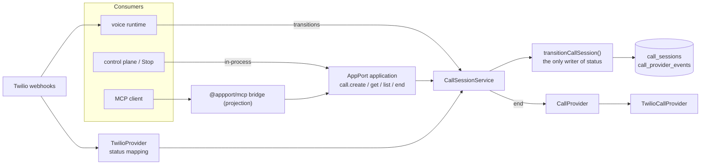
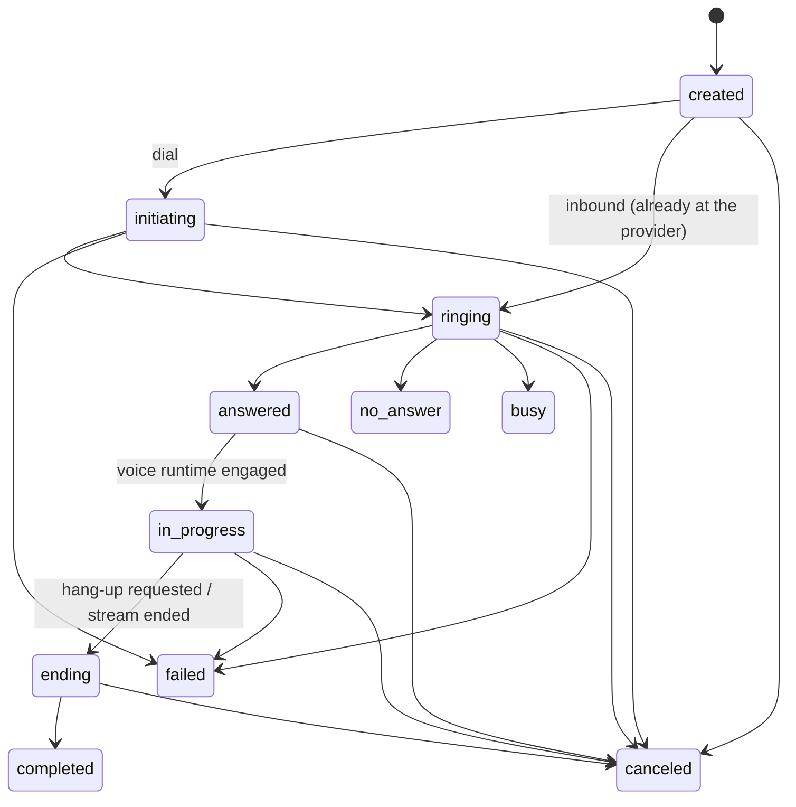

# CallSession

`CallSession` is the canonical, durable domain object for one phone call, inbound or outbound.
This document describes what is built. Where something is deliberately not built, it says so.

1. **CallSession is the canonical call domain object.** One record, one lifecycle, for every call.
2. **Twilio is a provider, not the domain model.** The application owns `CallSession.id`; Twilio owns `providerCallId`.
3. **Inbound and outbound share the same lifecycle.** `direction` is a field, not a separate architecture.
4. **AppPort exposes the capabilities** (`call.create`, `call.get`, `call.list`, `call.end`).
5. **MCP projects AppPort.** It is an adapter over the same capabilities, never a source of truth.
6. **The voice runtime operates against the CallSession.** The media stream reports into it; it never decides lifecycle.
7. **Autonomous outbound dialing is intentionally not part of this.** See [Not built](#not-built).



## The object

`src/calls/model.ts` (`CallSessionRecord`), table `call_sessions`:

| Field | Meaning |
|---|---|
| `id` | `call_` + uuid. **The domain identity.** Never a Twilio SID |
| `accountId` | The tenant. Every read and write is scoped by it |
| `direction` | `inbound` \| `outbound` |
| `status` | `created initiating ringing answered in_progress ending completed failed no_answer busy canceled` |
| `provider`, `providerCallId` | The telephony provider and its id for the call (null until the provider has one). Unique together |
| `from`, `to` | E.164 when valid. A carrier's `anonymous` caller is stored as null, never a reason to drop a call |
| `conversationId` | The owner-facing conversation (attention, SMS continuation) this call belongs to |
| `startedAt`, `answeredAt`, `endedAt`, `endReason` | Set by transitions |
| `version` | Increments on every persisted change; lets `call.get` wait for "the next state" |
| `requestedBy`, `traceId`, `idempotencyKey`, `requestFingerprint` | Who/what asked, for correlation and dedupe |
| `endClaimedAt`, `lastProviderStatus` | Internal: who may ask the provider to hang up; the last provider word, for diagnosis |

`conversations.status` (`received → answered → completed`) remains for the existing owner UI. It is a
**projection** of the CallSession lifecycle, written by the status webhook after the CallSession
transition; it is not a second source of truth for calls.

## Lifecycle



Rules (`decideTransition`, pure and tested exhaustively):

- Active states only move **forward**; a provider may skip events it never delivered (`ringing → completed` is allowed once dialing began).
- `completed` needs a call that got going (never from `created`); `no_answer`/`busy` only from `initiating`/`ringing`; `failed`/`canceled` from any active state; `ending` needs a provider call.
- **Terminal states are final**: nothing leaves `completed failed no_answer busy canceled`.
- A repeated transition is a `noop`; a late or earlier-state event is `stale`; a forward move the lifecycle forbids is `invalid`.

**One writer.** `transitionCallSession()` (`src/calls/transition.ts`) is the only code that writes `status`. It loads
the current state under the store's lock, validates, persists the status with the timestamps it implies, and is
safe to retry. Application commands use `strict` mode (an invalid move throws); provider callbacks and runtime
observations use `lenient` mode (late, duplicate or out-of-order events are reported, never errors). A test
(`architecture: status changes only through the transition function…`) fails the build if another module writes a status.

## Provider events and idempotency

```text
Twilio callback → TwilioProvider.parseStatusUpdate → mapTwilioCallStatus() → CallSessionStatus | null
                → CallSessionService.applyProviderEvent → transitionCallSession
```

- `src/calls/provider-status.ts` is the translation boundary: `queued/initiated→initiating`, `ringing→ringing`, `in-progress→answered`, `completed`, `busy`, `failed`, `no-answer→no_answer`, `canceled`. **A status not in the table maps to `null` and is acknowledged with 200**; it used to be an HTTP 400.
- **Event identity** is built only from fields Twilio sends: `CallSid:CallStatus`, plus `:SequenceNumber` when the callback carries one. (Twilio documents `SequenceNumber` for status callbacks; this was not re-verified against Twilio in this environment, and its absence is handled.)
- Each callback is recorded once in `call_provider_events (provider, event_id)` **inside the same transaction** that locks the session row (`SELECT … FOR UPDATE`). A redelivery, even one racing another instance, is reported as `duplicate` and changes nothing. Tests: 10 simultaneous identical callbacks → exactly one applied; two server instances on one database → one recorded event.
- Side effects of the status webhook (owner attention, conversation projection) run only for an `applied` event.
- A callback for a call we never saw: early lifecycle events (`initiated`/`ringing`) are acknowledged (the call may still be registering); anything else is a 404 as before. A call that predates CallSessions is **adopted** from its conversation on first contact.
- `completed` (or any terminal status) after the call already ended, and `ringing` after `answered`, are `stale`: acknowledged, nothing changes.

## Capabilities (AppPort)

`src/appport/call-application.ts`. One AppPort application, `app.justtextme.calls`, built with `@appport/core`. No second capability system.

| Capability | Permission | Notes |
|---|---|---|
| `call.create@1` | `call.create` (admins/owners) | Establishes the domain object, returns `{callId, status}`. **Outbound: created, never dialed.** Inbound: requires `call.ingest` (the telephony webhook only) and a provider call; it is recorded as `ringing`. Idempotent |
| `call.get@1` | `call.read` | The canonical state. `waitSeconds` (clamped to 20, and never past the request's deadline) and `sinceVersion` make `create → get → wait → get` work without push |
| `call.list@1` | `call.read` | `status[]`, `direction`, `createdAfter/Before`, `limit` (≤100), opaque `cursor`; newest first; inbound and outbound |
| `call.end@1` | `call.control` | Idempotent. A terminal call is returned as is; otherwise exactly one request claims the hang-up and asks the provider. Keyed concurrency on `callId` |

No `call.answer`: nothing in the current architecture needs an explicit answer operation (inbound calls are answered by the webhook's TwiML).
Outputs carry `callId`, never the provider id or any internal field, so no consumer has to understand Twilio.

**Ownership.** The account comes from the authorized session (`session.attributes.accountId`), never from input. Another account's
call is reported exactly like a missing one (`NOT_FOUND`, same message), for `get`, `end` and `list`. Members read and end; only
admins/owners create; `call.ingest` is held only by the telephony webhook's session (`telephonySessionFor`, built from the account that
owns the *called number*). AuthBoundry is not required; the `Session` the capabilities run under is the seam where it could decide.

**Request metadata is preserved**, on the AppPort envelope: the idempotency key and trace id become part of the durable record
(`idempotencyKey`, `traceId`) and of every log line; `timeoutMs`/deadline bounds `call.get` waits. AppPort core's built-in idempotency
replay cache is **in memory** and replays a stored response whatever the new input is, which on a serverless deployment would make key reuse
depend on which instance answered. The call application therefore disables it and lets the durable CallSession decide: unique per
(account, key) with a request fingerprint, so the same request is the same call everywhere, and a *different* request under the same key is a `CONFLICT`.

**In-process.** `CallCapabilityClient` (`src/appport/call-client.ts`) calls `application.handleRequest` directly: no HTTP round trip, same
validation, authorization and metadata. Owner **Stop** uses it (`call.end`, idempotency key `owner-stop:<conversation>`).

**MCP.** `createCallMcpBridge` (`src/appport/mcp.ts`) is `@appport/mcp`'s own `createMcpBridge`, unchanged, restricted to `call.*`. It
yields the tools `call_create`, `call_get`, `call_list`, `call_end` with the capabilities' own schemas and permissions, through the same
dispatch. There is no JSON-RPC, transport or MCP implementation in this repository. **Not yet mounted on a network endpoint**: `@appport/mcp@1.0.2`
ships no server or transport (it says "wire `listTools`/`callTool` into an MCP server").

> **Known limitation — metadata over MCP.** `@appport/mcp@1.0.2`'s `callTool` builds its request from only `requestId`, `capability` and
> `input`, so an idempotency key, timeout and trace id **cannot be carried over MCP** with the published package. The fix is small and is
> prepared as [`upstream/appport-mcp-request-metadata.patch`](upstream/appport-mcp-request-metadata.patch) against
> `rkendel1/appport` (`callTool(name, args, meta?)`, with a test that fails without it). Until it is released and adopted, **do not expose
> outbound dialing over MCP** (this PR does not dial from `call.create`, so nothing is at risk today).

## Provider boundary

`CallProvider` (`src/calls/provider.ts`): `createCall`, `endCall(providerCallId, {mode: 'cancel' | 'complete'})`. `TwilioCallProvider`
(`src/telephony/twilio-call-provider.ts`) is the **only** place `client.calls.create/update` is used (a test guards this), including
the owner test call and the spoken verification code. `cancel` is used for a call not yet answered and `complete` for one that was;
Twilio's acceptance of `canceled` for a ringing call was not exercised against Twilio here.

## Where calls come from

- **Inbound.** `POST /webhooks/twilio/voice` → the conversation as before → `CallSessionService.openProviderCall` (idempotent on the provider call) → `ringing` → after the existing TwiML decision, `answered`. The media stream (`<Parameter callSessionId>`) or, without a stream host, the first spoken turn moves it to `in_progress`; the stream's claim is **verified** (the session must be this conversation's, in this account) and ignored otherwise. A stream that ends records `ending`; one that fails records `failed`; the provider's callbacks complete it. **If the CallSession cannot be recorded, the call is still answered** (logged, not dropped).
- **Owner test call** (existing, human-confirmed). `CallSessionService.create` (the operation `call.create` exposes) → `created` → `initiating` → Twilio's id attached → status callbacks (`initiated/ringing/answered/completed` are now requested) → the owner presses 1 and Twilio requests instructions on the *same* call, which is linked to its new conversation.

## Persistence

Created on first use with the repository's existing convention (`CREATE TABLE IF NOT EXISTS` under the advisory-lock `migrate()` helper; no new tooling):

- `call_sessions`, CHECK constraints on `direction` and `status`.
- `call_provider_events (provider, event_id)` primary key, cascade-deleted with the session.
- Indexes, each tied to a query: unique `(provider, provider_call_id)` (webhook lookup and one session per provider call); unique `(account_id, idempotency_key)` (retry lands on the same call); `(account_id, created_at DESC, id DESC)` (`call.list` keyset paging); `(account_id, status, created_at DESC)` (`call.list` by status); `(conversation_id)` (owner Stop resolves a conversation's call); `call_provider_events (call_session_id)` (cascade and diagnostics).

## Observability

`src/calls/log.ts`: one JSON line per event through `console` (the repository's existing convention, tagged `[call]`), always carrying `callId`,
`providerCallId` and `traceId`; phone numbers are masked (`+1••••••0123`); nothing secret is logged. The trace id is Vercel's `x-vercel-id` (else `x-request-id`)
for webhooks and the AppPort request's trace id for capabilities.

## Not built

Deliberately left for later PRs: autonomous/scheduled/bulk outbound dialing; answering-machine detection; AI-disclosure, consent, calling-window and
recording-consent policy; retries and voicemail strategy; contact lists and campaigns; an MCP server transport; `call.answer`/`call.handoff`; an `operations.*`
view of calls (core's operation reader has no per-tenant ownership hook, so calls are read through `call.get`).
